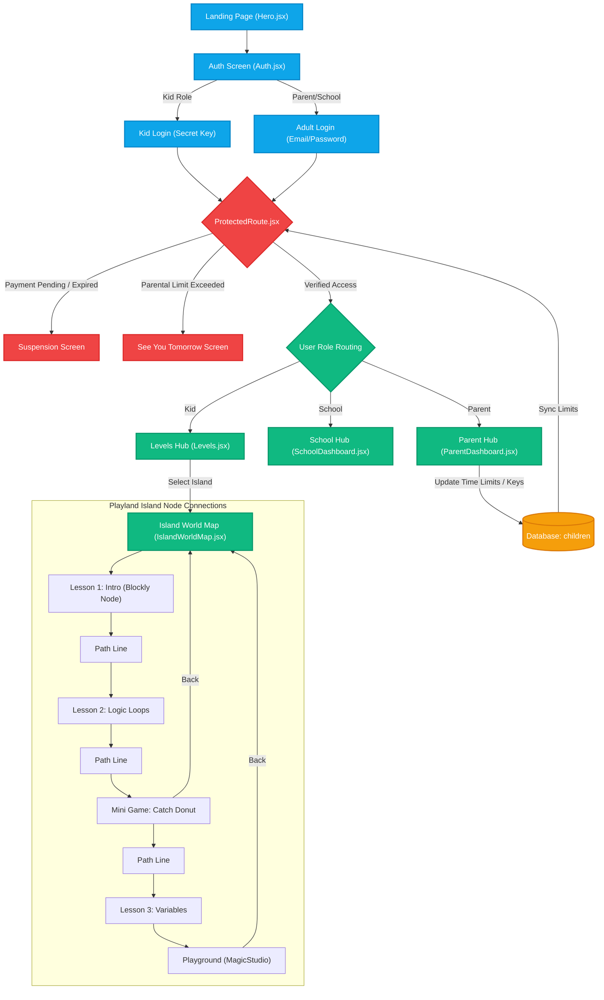

# Project Structure & Architecture Guide

Welcome to the Kido Dev frontend architecture reference. This document provides a high-level walkthrough of the codebase, directories, key components, and graphical page flow.

---

## 📂 Directory Structure

```text
├── .agents/                    # Agent-specific workflows and workspace instructions
├── dist/                       # Production build directory (compiled static assets)
├── public/                     # Public static assets (videos, sprites, standard assets)
├── src/
│   ├── assets/                 # Component assets, including images and styling inputs
│   │   └── no_bg_output/       # Pre-processed clean transparent WebP/JPG assets
│   ├── components/             # Global reusable components
│   │   ├── Loader/             # Custom animated page/sprite loaders
│   │   ├── Navbar.jsx          # Dynamic Top Navigation Bar
│   │   ├── Footer.jsx          # Interactive clouds & site links footer
│   │   └── ProtectedRoute.jsx  # Parental control timer, payment check, & auth shield
│   ├── pages/                  # Main route views
│   │   ├── Admin/              # Kido Admin settings, content uploaders, & analytics
│   │   ├── Auth/               # Registration & Login components
│   │   │   ├── ParentDashboard/# Parent interface, child management, & time limits
│   │   │   ├── SchoolDashboard/# School class management & key downloads
│   │   │   ├── Auth.jsx        # Login entry point with dynamic background themes
│   │   │   └── auth.css        # Auth styles (frosted cards & theme-aware colors)
│   │   ├── Games/              # Built-in Canvas/DOM Mini-games
│   │   │   ├── CatchDonut.jsx  # Donut catching arcade game
│   │   │   ├── TrafficPatrol.jsx # Logic-based traffic directing
│   │   │   └── CoinMaze.jsx    # Sprite-moving pathing maze
│   │   ├── MagicStudio/        # Core Blockly drag-and-drop programming playground
│   │   ├── Levels.jsx          # World Selection Hub (Beginner, Explorer, etc.)
│   │   └── IslandWorldMap.jsx  # Path connections representing learning nodes
│   ├── scss/                   # Custom theme-specific SCSS files
│   └── utils/                  # Core client-side utility services
│       ├── supabaseClient.js   # Supabase backend client configuration
│       └── ThemeContext.jsx    # React Context managing Forest vs. Princess themes
├── index.html                  # Main DOM index file
├── vite.config.js              # Vite compiler configuration
└── package.json                # Project dependencies and building scripts
```

---

## 📊 Graphical Flow & Node Connections

The following diagram illustrates how a user flows through the app's components, how the `ProtectedRoute` intercepts navigation to verify parental controls, and how the learning nodes are connected inside the play islands.



---

## 🛠️ Key Architectural Subsystems

### 1. The Theme Engine (`ThemeContext.jsx`)
- Controls global visual settings (`forest` vs. `princess`).
- Directly shifts loaded graphics, buttons, background images, and brand accents automatically across all sub-pages.
- When the parent toggles the theme, the login background changes smoothly between `loginbg.jpg` (Forest) and `loginbgbarbie.jpg` (Princess).

### 2. The Parental Control Shield (`ProtectedRoute.jsx`)
- Calculates daily usage in minutes via `localStorage` caches (`kido_usage_${childId}`).
- Implements **multi-tab sync protection** (`kido_usage_last_${childId}`) to prevent double-counting when multiple tabs are open.
- Honors `null` or `0` limits as **No Limit (Default)** to ensure kid accounts are never blocked.
- Evaluates payment status and redirects immediately if account suspension occurs.

### 3. The Gamified Blockly Workspace (`MagicStudio/`)
- Integrates Blockly engine workspaces directly inside a responsive canvas.
- Interprets kid-created blocks programmatically to animate visual sprites on the screen.
