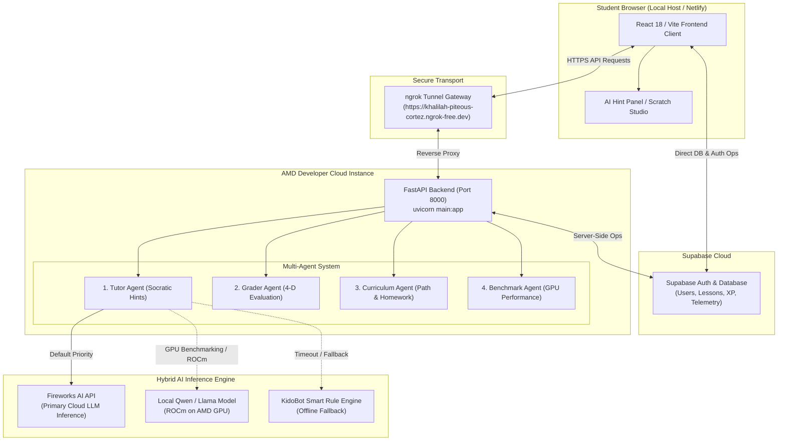
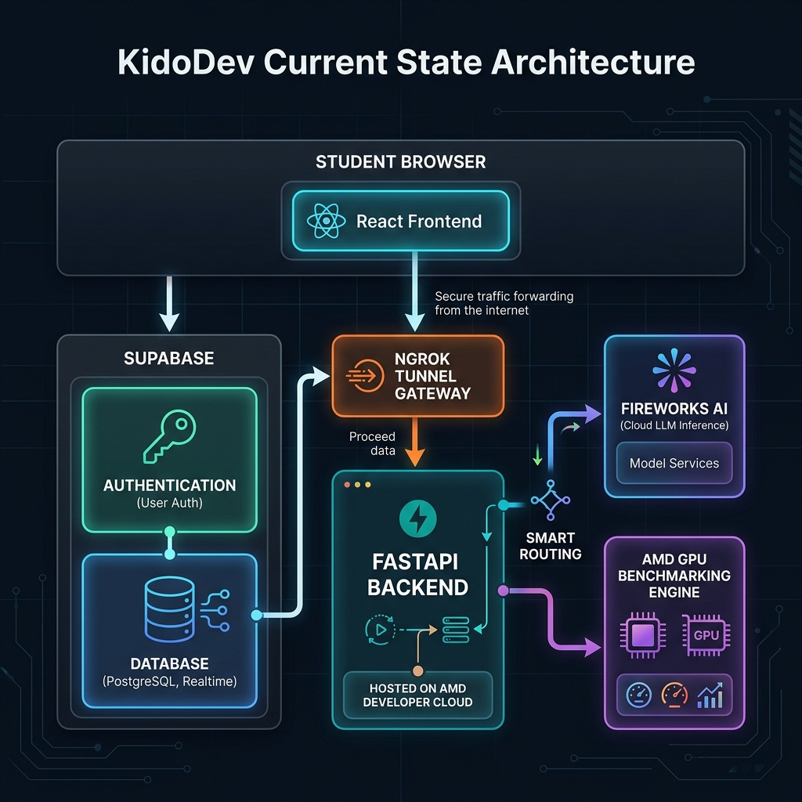
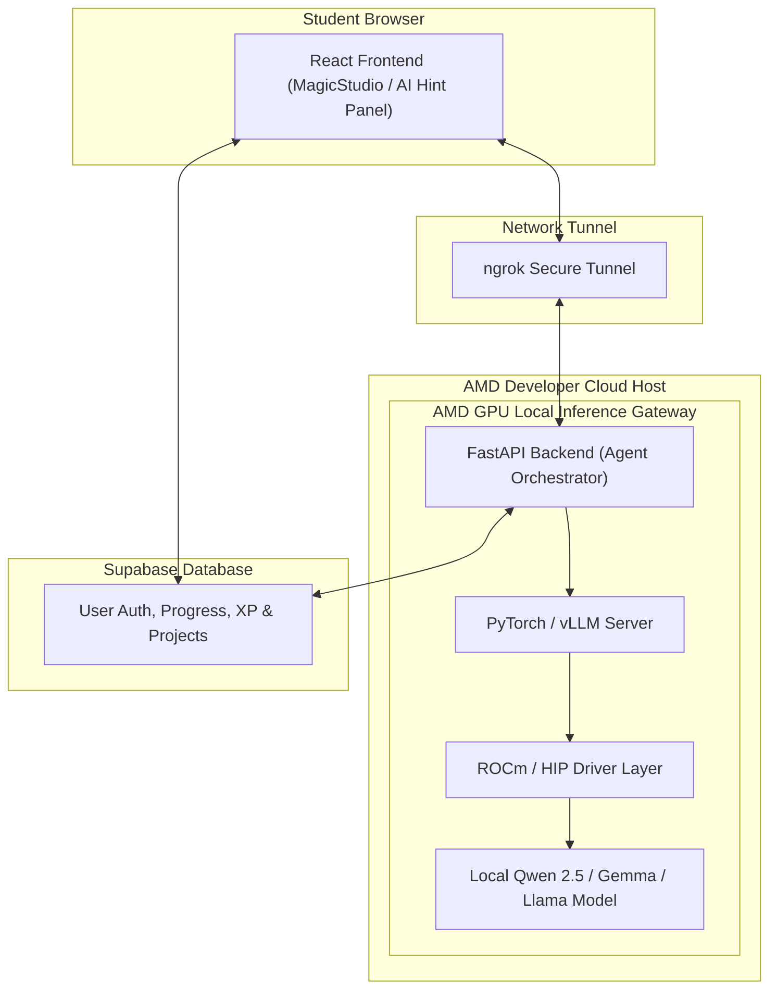
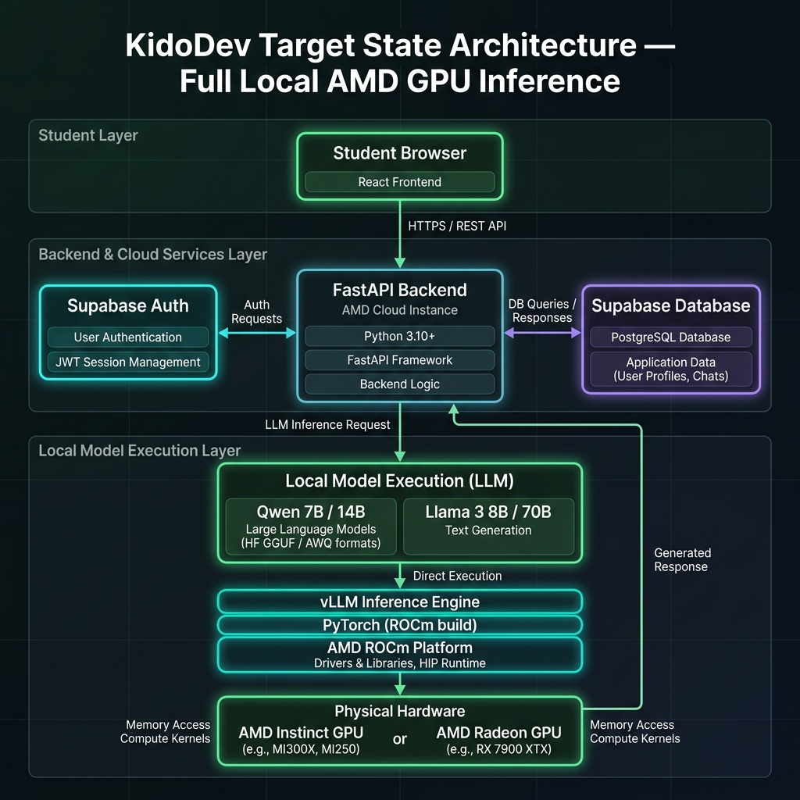

<div align="center">
  <h1>KidoDev — AI-Powered Learning Platform</h1>
  <p><strong>Multi-Agent Pedagogical Copilot Powered by AMD Developer Cloud & Hybrid AI Inference Engine</strong></p>
  <p>🏆 <strong>AMD Hackathon — Track 2: Agentic AI Submission</strong></p>
  <p>🌐 <strong>Live Web App:</strong> <a href="https://kidodevai.netlify.app">kidodevai.netlify.app</a></p>
  <p>🔗 <strong>Backend Ngrok Gateway:</strong> <code>https://khalilah-piteous-cortez.ngrok-free.dev</code></p>
</div>

---

## 📌 KidoDev + AMD Developer Cloud Architecture Overview

**KidoDev** is an AI-powered learning platform that teaches Scratch programming to children through an intelligent agentic tutor. 

Instead of running all AI models locally on a user's machine, the platform combines:
- **AMD Developer Cloud:** GPU compute environment where FastAPI backend services run and where ROCm-accelerated LLM inference is hosted and benchmarked.
- **Fireworks AI:** Hosted cloud LLM inference engine providing low-latency prompt completion.
- **Supabase:** Authentication, relational database, user progress, XP, and benchmark logging.
- **FastAPI Backend:** The brain of the platform orchestrating multi-agent reasoning, prompt engineering, grading, and model routing.
- **React Frontend:** Interactive kid-friendly Scratch editor (`MagicStudio`), dashboards, and live tutoring UI.
- **ngrok:** Secure tunnel exposing the AMD Cloud instance backend (`https://xxxxx.ngrok-free.dev` -> `localhost:8000`).

---

## 🏗️ Overall Architecture & Data Flow

```text
                    Student Browser
                           │
                    React Frontend
                           │
            ┌──────────────┴───────────────┐
            │                              │
       Supabase                     FastAPI Backend
   Auth + Database              (AMD Cloud Instance)
            │                              │
            │                              │
            │                      Agent Orchestrator
            │                              │
            │             ┌────────────────┴───────────────┐
            │             │                                │
            │      Fireworks API                  Local Qwen Model
            │      (Cloud Inference)             (AMD GPU - optional)
            │
            └────────── Student Progress
```

### 1. Current State Architecture Diagram (Production Setup)



<div align="center">
  
  <p><em>Figure 1: KidoDev Current Architecture — React Frontend, Supabase, FastAPI on AMD Developer Cloud, and Hybrid AI Inference Pipeline</em></p>
</div>

---

### 2. Target State Architecture Diagram (Full Local AMD GPU Inference)

As migration to full local inference completes, the AMD Developer Cloud GPU directly executes model inference via **ROCm / PyTorch / vLLM**, eliminating third-party cloud LLM dependencies:



<div align="center">
  
  <p><em>Figure 2: KidoDev Target Architecture — Full Local LLM Inference on AMD Radeon / Cloud GPU via ROCm</em></p>
</div>

---

## 🧩 System Components & Responsibilities

### 1. React Frontend
- **Environment:** Runs locally via `npm run dev` (`http://localhost:5173`) or deployed on Netlify.
- **Responsibilities:** Student login, Scratch visual editor (`MagicStudio`), AI Hint Panel, Sprite Guide Agent, disengagement observation, Parent Dashboard, and School Admin Dashboard.
- **Note:** The frontend never performs AI reasoning itself; it sends payload requests to the backend.

### 2. FastAPI Backend
- **Environment:** Runs inside the AMD Developer Cloud (`uvicorn main:app --host 0.0.0.0 --port 8000`).
- **Responsibilities:** AI orchestration, prompt engineering, Socratic tutoring, curriculum roadmaps with targeted homework, student 4-D submission grading, and GPU latency/throughput benchmarking.

### 3. AMD Developer Cloud
- **Features:** Provides GPU compute, high-capacity memory, CPU, storage, Linux OS, and Python environment.
- **Purpose:** Serves as the high-performance execution environment for backend services, GPU benchmarking, and local ROCm model inference.

### 4. ngrok Tunneling
- **Purpose:** Securely exposes the AMD Cloud host's `localhost:8000` port to the web over HTTPS (`https://khalilah-piteous-cortez.ngrok-free.dev`).

### 5. Supabase
- **Purpose:** Manages authentication and stores users, children profiles, completed lessons, achievements, XP, Scratch project XMLs, and benchmark logs.

---

## 🔄 AI Pipeline & Data Flow

When a student clicks **"Need Hint"** in the AI Hint Panel:

1. **Trigger:** Student clicks *Generate Hint*.
2. **Context Gathering:** React gathers current Scratch workspace blocks, lesson objective, student level, and progress metrics.
3. **API Dispatch:** Request sent from Frontend → ngrok URL → FastAPI Backend on AMD Cloud.
4. **Prompt Engineering:** FastAPI constructs context-rich prompt (age, difficulty, workspace AST, past mistakes).
5. **Model Routing Execution:**
   - **Priority 1 (Fireworks API):** Fast cloud LLM inference for low-latency completions.
   - **Priority 2 (Local AMD Model):** ROCm-accelerated local model (Qwen/Llama/Gemma) running on AMD GPU via PyTorch/vLLM.
   - **Priority 3 (Rule-Based Fallback):** Offline context-aware fallback engine.
6. **Response:** Backend returns structured JSON hint message and block guidance to the AI Hint Panel.

---

## 🤖 Agentic System & Benchmarking

KidoDev features specialized autonomous agents:
- **Tutor Agent:** Multi-turn ReAct reasoning producing Socratic explanations and XML diffs.
- **Curriculum Agent:** Creates personalized lesson flow and generates targeted homework assignments for weak block categories.
- **Grader Agent:** Evaluates submissions across 4 dimensions (*Correctness*, *Efficiency*, *Independence*, *Creativity*).
- **Benchmark Agent:** Measures model inference speed (**tokens/second**), latency (**ms**), VRAM memory usage, and GPU throughput on AMD hardware (`/benchmark/run`, `/benchmark/history`).

---

## 🔄 Current State vs. Target State Summary

| Component | Current State | Target State |
|---|---|---|
| **Frontend** | React (Local / Netlify) | React (Local / Netlify) |
| **Backend** | FastAPI on AMD Cloud Host | FastAPI on AMD Cloud Host |
| **Database** | Supabase | Supabase |
| **Authentication** | Supabase Auth | Supabase Auth |
| **AI Inference** | Fireworks AI (Cloud-hosted) | Local model on AMD GPU via ROCm |
| **Public Access** | ngrok tunnel gateway | ngrok tunnel or production domain |
| **GPU Usage** | Backend hosting & GPU benchmarking | Backend hosting & full local LLM inference |

---

## 🔑 Demo Credentials & Quick Access

- **Student Studio Access:** Secret Key `TEST1` or `ADMINPARENTCHILD1`
- **Parent Dashboard:** Username `12345678` / Password `12345678`
- **School Admin Dashboard:** Email `adminschool@gmail.com` / Password `adminschool@gmail.com`

---

## ⚙️ Environment Variables & Setup Guide

### 1. Environment Variables

#### **Frontend (`frontend/.env`)**
```env
VITE_SUPABASE_URL=https://cvdbnxeqbirrdyfwrgso.supabase.co
VITE_SUPABASE_ANON_KEY=sb_publishable_oh-OLBt29AfkWdhg5zIOrg_nf1cva3z
VITE_FIREWORKS_API_KEY=fw_3Z...
VITE_FIREWORKS_MODEL=accounts/fireworks/models/qwen2p5-coder-32b-instruct
VITE_AGENT_BACKEND_URL=https://khalilah-piteous-cortez.ngrok-free.dev
VITE_BACKEND_WS_URL=wss://khalilah-piteous-cortez.ngrok-free.dev
```

#### **Backend (`backend/.env`)**
```env
SUPABASE_URL=https://cvdbnxeqbirrdyfwrgso.supabase.co
SUPABASE_SERVICE_ROLE_KEY=sb_publishable_oh-OLBt29AfkWdhg5zIOrg_nf1cva3z
FIREWORKS_API_KEY=fw_3Z...
MODEL_NAME=accounts/fireworks/models/qwen2p5-coder-32b-instruct
QWEN_HOST=http://localhost:11434
PORT=8000
ALLOWED_ORIGINS=http://localhost:5173,https://kidodevai.netlify.app
```

---

### 2. Execution Commands

#### **Frontend Execution**
```bash
npm install
npm run dev
# Running at http://localhost:5173
```

#### **Backend Execution (On AMD Cloud Machine)**
```bash
cd backend
pip install -r requirements.txt
uvicorn main:app --host 0.0.0.0 --port 8000 --reload

# Start ngrok secure tunnel
ngrok http 8000 --url=https://khalilah-piteous-cortez.ngrok-free.dev
```

---

## 📜 License

Released under the **MIT License** for open-source compliance.
