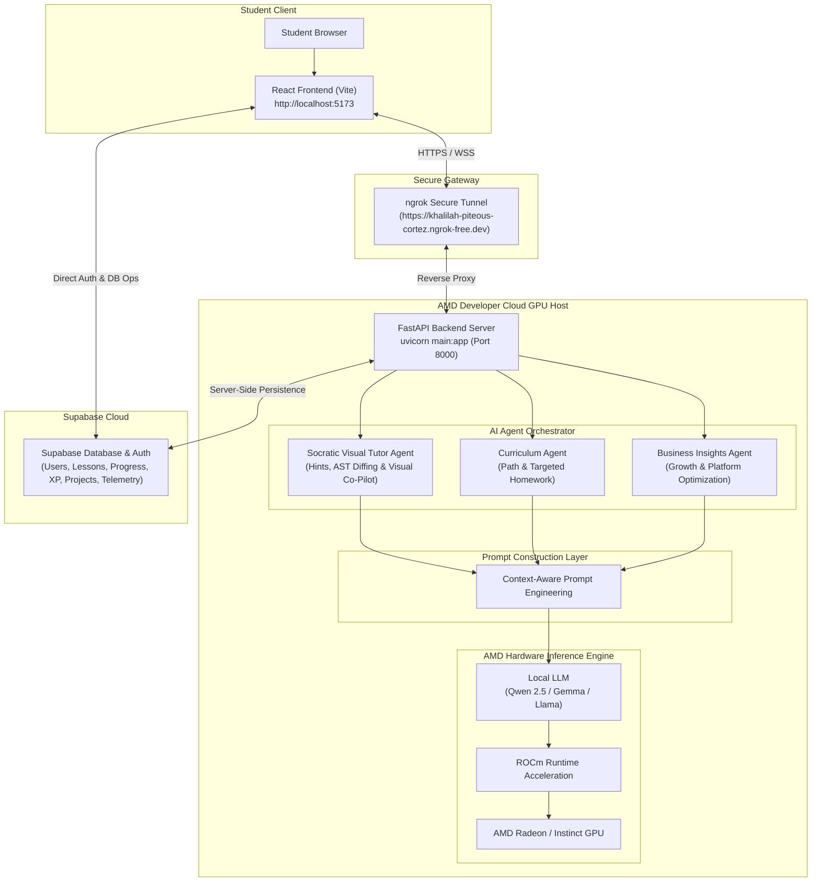

<div align="center">
  <h1>KidoDev + AMD Developer Cloud Architecture</h1>
  <p><strong>Direct AMD GPU Inference & Multi-Agent Pedagogical Copilot</strong></p>
  <p>🏆 <strong>AMD Hackathon — Track 2: Agentic AI Submission</strong></p>
  <p>🔗 <strong>Backend Ngrok Gateway:</strong> <code>https://khalilah-piteous-cortez.ngrok-free.dev</code></p>
</div>

---

## 📌 Executive Overview

**KidoDev** is an AI-powered educational platform that teaches children Scratch programming through an intelligent AI tutor. The entire AI reasoning pipeline runs directly on an AMD GPU hosted in the **AMD Developer Cloud**, eliminating dependency on external inference providers.

The AMD GPU serves the FastAPI backend, executing language models (`Qwen 2.5 1.5B`) natively using **ROCm**, and generating personalized tutoring and business intelligence in real time.

---

## 📸 AMD Developer Cloud GPU Telemetry Verification

Verification captures demonstrating direct execution on AMD Cloud GPU hardware via ROCm stack:

<div align="center">
  
  <p><em>Figure 1: Verified AMD Developer Cloud Environment — PyTorch ROCm (HIP 7.2) & Model Weights Load</em></p>
  <br/>
  
  <p><em>Figure 2: GPU Allocation (`cuda:0` on ROCm) & Qwen 2.5 Local Execution Telemetry</em></p>
</div>

---

## 🏗️ High-Level System Architecture



<div align="center">
  
  <p><em>Figure 3: KidoDev + AMD Developer Cloud Architecture — Direct Local AMD GPU Inference via ROCm Stack</em></p>
</div>

---

## 🔄 AI Request & Learning Pipeline

When a student requests help or parent opens insights:

```text
Student / Parent Request
      │
      ▼
React Frontend (Collects Scratch AST, lesson metadata, student progress)
      │
      ▼
Send Request to FastAPI (via ngrok tunnel)
      │
      ▼
Agent Orchestrator → Specialist Agent (Tutor / Curriculum / Business)
      │
      ▼
Prompt Construction Layer
      │
      ▼
Local LLM (Qwen 2.5 1.5B)
      │
      ▼
ROCm Runtime Acceleration → AMD GPU
      │
      ▼
Generate Response → FastAPI Backend
      │
      ▼
JSON Response → React Frontend & Supabase Persistence
```

---

## 🧩 System Components

### 1. React Frontend
- **Environment:** Runs at `http://localhost:5173`.
- **Responsibilities:** Student Scratch workspace (`MagicStudio`), live voice & visual guidance, parent dashboard, admin intelligence dashboard, and real-time communication with the backend.

### 2. ngrok Secure Tunnel
- **Purpose:** Exposes the AMD Developer Cloud backend through a secure HTTPS endpoint (`https://khalilah-piteous-cortez.ngrok-free.dev`).
- **Communication Path:** `Browser` → `HTTPS` → `ngrok` → `FastAPI Backend`.

### 3. AMD Developer Cloud Host
- **Host Infrastructure:** AMD GPU, Linux OS environment, Python virtualenv (`llm-env`), ROCm software stack (HIP 7.2), and FastAPI server.
- **Execution Command:** `source llm-env/bin/activate && uvicorn main:app --host 0.0.0.0 --port 8000`

### 4. AI Agent Architecture (3 Active Agents)
- **Socratic Visual Tutor Agent (`KidoBot` / `Cat Co-Pilot`):** Multi-turn ReAct reasoning + XML AST gap diffing for Socratic hints with autonomous visual sprite guidance via SVG matrix calculations (`getScreenCTM()`).
- **Curriculum Agent:** Analyzes weak block categories, lesson progression, and generates personalized learning paths with targeted homework missions.
- **Business Insights Agent:** Strategic C-suite financial intelligence engine analyzing platform enrollment, ARPU, LTV:CAC, PLG growth, and churn risk mitigations.

### 5. Local AI Model Engine
- **Execution Engine:** Open-source instruction LLMs (Qwen 2.5 1.5B) execute directly on AMD GPU hardware.
- **Inference Stack:** `HuggingFace Transformers` → `ROCm` → `AMD GPU`.
- **Key Advantages:** Zero external API fees, sub-second latency, offline capability, complete data privacy, and native AMD hardware acceleration.

### 6. Supabase Persistence
- **Data Persistence:** User authentication, student profiles, parent accounts, lesson progress, XP, badges, Scratch projects, and agent telemetry logs.

---

## 🔑 Demo Credentials & Quick Access

- **Admin Command Center:** Username `admin@gmail.com` / Password `admin123`
- **Student Studio Access:** Secret Key `TEST1` or `ADMINPARENTCHILD1`
- **Parent Dashboard:** Username `12345678` / Password `12345678`
- **School Admin Dashboard:** Email `adminschool@gmail.com` / Password `adminschool@gmail.com`

---

## ⚙️ Environment Variables

### **Frontend (`frontend/.env`)**
```env
VITE_SUPABASE_URL=https://cvdbnxeqbirrdyfwrgso.supabase.co
VITE_SUPABASE_ANON_KEY=sb_publishable_oh-OLBt29AfkWdhg5zIOrg_nf1cva3z
VITE_AGENT_BACKEND_URL=https://khalilah-piteous-cortez.ngrok-free.dev
VITE_BACKEND_WS_URL=wss://khalilah-piteous-cortez.ngrok-free.dev
```

### **Backend (`backend/.env`)**
```env
SUPABASE_URL=https://cvdbnxeqbirrdyfwrgso.supabase.co
SUPABASE_SERVICE_ROLE_KEY=sb_publishable_oh-OLBt29AfkWdhg5zIOrg_nf1cva3z
MODEL_NAME=qwen2.5-1.5b
DEVICE=rocm
PORT=8000
ALLOWED_ORIGINS=http://localhost:5173,http://localhost:3000
```

---

## 🚀 Why AMD Developer Cloud?

AMD Developer Cloud enables KidoDev to function as a complete AI learning platform without relying on external inference services.

It provides:
1. **High-performance AMD GPUs** for local LLM inference.
2. **ROCm acceleration** for efficient execution of open-source models.
3. A Linux-based development and deployment environment.
4. A scalable environment that closely resembles production infrastructure.

---

## 📜 License

Released under the **MIT License** for open-source compliance.
