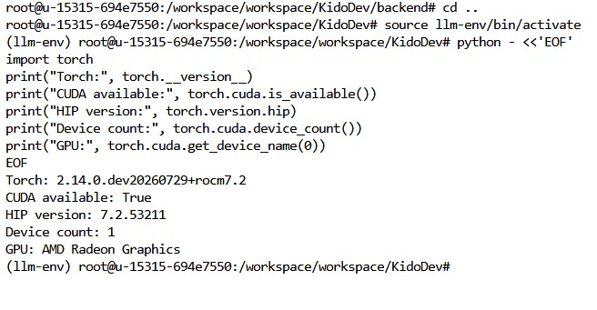
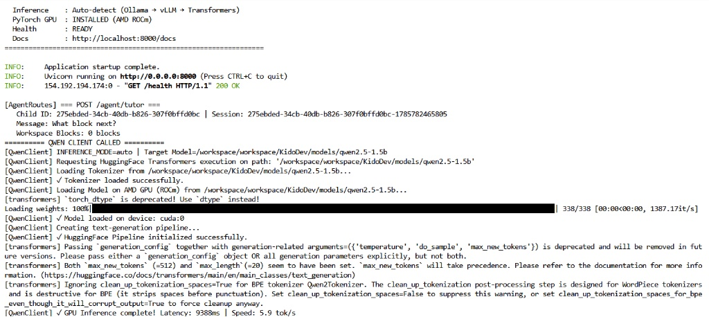
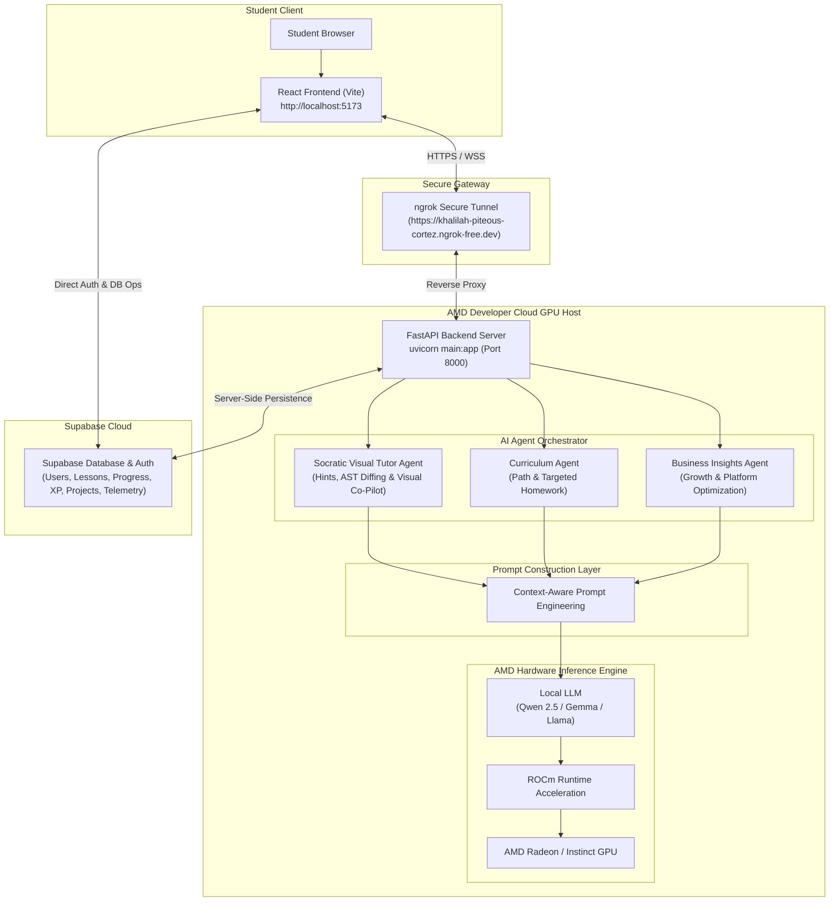
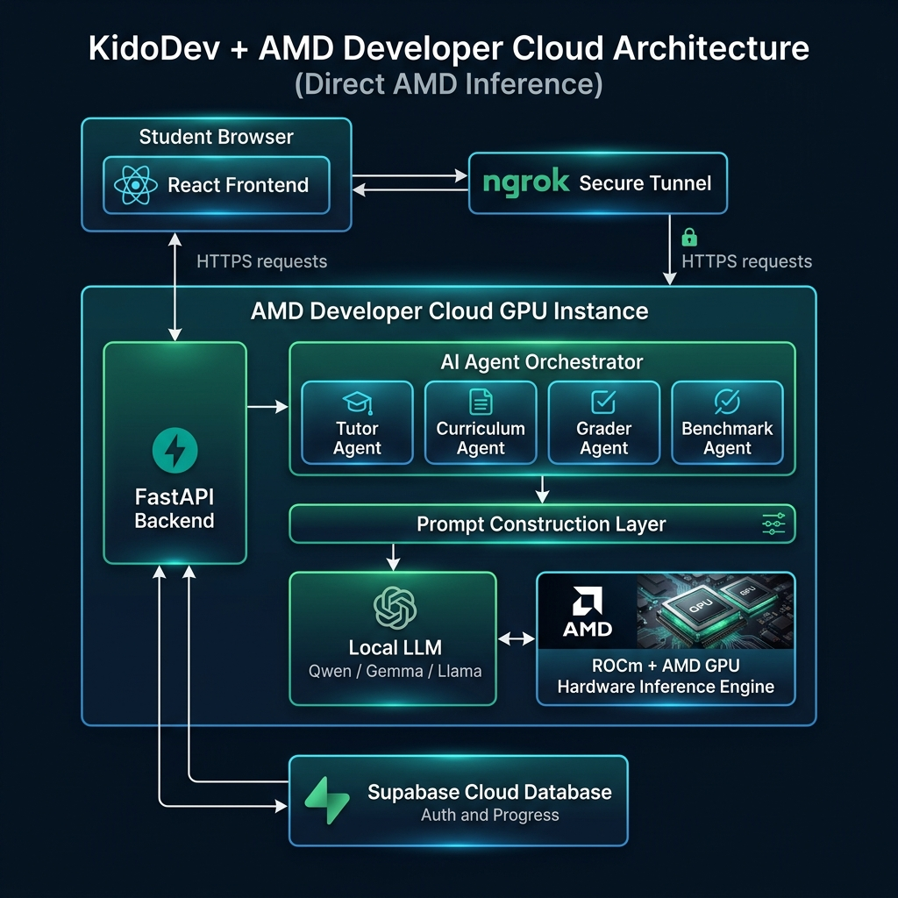

<div align="center">
  <h1>KidoDev + AMD Developer Cloud Architecture</h1>
  <p><strong>Direct AMD GPU Inference & Multi-Agent Pedagogical Copilot</strong></p>
  <p>🏆 <strong>AMD Hackathon — Track 2: Agentic AI Submission</strong></p>
  <p>🔗 <strong>Backend Ngrok Gateway:</strong> <code>https://khalilah-piteous-cortez.ngrok-free.dev</code></p>
</div>

---

## 📌 Executive Overview

**KidoDev** is an AI-powered educational platform that teaches children Scratch programming through an intelligent AI tutor. The entire AI reasoning pipeline runs directly on an AMD GPU hosted in the **AMD Developer Cloud**, eliminating dependency on external inference providers.

The AMD GPU serves the FastAPI backend, executing language models (`Qwen 2.5 1.5B`) natively using **ROCm**, and generating personalized tutoring and business intelligence in real time.

---

## 📸 AMD Developer Cloud GPU Telemetry Verification

Verification captures demonstrating direct execution on AMD Cloud GPU hardware via ROCm stack:

<div align="center">
  
  <p><em>Figure 1: Verified AMD Developer Cloud Environment — PyTorch ROCm (HIP 7.2) & Model Weights Load</em></p>
  <br/>
  
  <p><em>Figure 2: GPU Allocation (`cuda:0` on ROCm) & Qwen 2.5 Local Execution Telemetry</em></p>
</div>

---

## 🏗️ High-Level System Architecture



<div align="center">
  
  <p><em>Figure 3: KidoDev + AMD Developer Cloud Architecture — Direct Local AMD GPU Inference via ROCm Stack</em></p>
</div>

---

## 🔄 AI Request & Learning Pipeline

When a student requests help or parent opens insights:

```text
Student / Parent Request
      │
      ▼
React Frontend (Collects Scratch AST, lesson metadata, student progress)
      │
      ▼
Send Request to FastAPI (via ngrok tunnel)
      │
      ▼
Agent Orchestrator → Specialist Agent (Tutor / Curriculum / Business)
      │
      ▼
Prompt Construction Layer
      │
      ▼
Local LLM (Qwen 2.5 1.5B)
      │
      ▼
ROCm Runtime Acceleration → AMD GPU
      │
      ▼
Generate Response → FastAPI Backend
      │
      ▼
JSON Response → React Frontend & Supabase Persistence
```

---

## 🧩 System Components

### 1. React Frontend
- **Environment:** Runs at `http://localhost:5173`.
- **Responsibilities:** Student Scratch workspace (`MagicStudio`), live voice & visual guidance, parent dashboard, admin intelligence dashboard, and real-time communication with the backend.

### 2. ngrok Secure Tunnel
- **Purpose:** Exposes the AMD Developer Cloud backend through a secure HTTPS endpoint (`https://khalilah-piteous-cortez.ngrok-free.dev`).
- **Communication Path:** `Browser` → `HTTPS` → `ngrok` → `FastAPI Backend`.

### 3. AMD Developer Cloud Host
- **Host Infrastructure:** AMD GPU, Linux OS environment, Python virtualenv (`llm-env`), ROCm software stack (HIP 7.2), and FastAPI server.

---

## 🚀 Quick Start & Installation Guide

### **1. Backend Setup (AMD Developer Cloud / ROCm Host)**
```bash
# 1. Navigate to the backend directory
cd /workspace/workspace/KidoDev/backend

# 2. Activate the PyTorch ROCm virtual environment
source /workspace/workspace/KidoDev/llm-env/bin/activate

# 3. Install Python dependencies
pip install -r requirements.txt

# 4. Launch the FastAPI server on port 8000
uvicorn main:app --host 0.0.0.0 --port 8000
```

### **2. Frontend Setup (Local Web App)**
```bash
# 1. Navigate to the frontend directory
cd frontend

# 2. Install Node dependencies
npm install

# 3. Start the Vite development server
npm run dev
```

### 4. AI Agent Architecture (3 Active Agents)

KidoDev coordinates three specialized AI agents to deliver real-time Socratic tutoring, adaptive curriculum planning, and executive business strategy:

---

#### 🧠🐱 **1. Socratic Visual Tutor Agent (`KidoBot` / `Cat Co-Pilot`)**
- **How it Works:**
  - **Multi-Turn ReAct Reasoning:** Evaluates student conversation history and workspace state across multiple interaction turns.
  - **XML AST Gap Diffing:** Extracts the student's current Blockly XML workspace blocks and compares them against the lesson's target XML AST structure to find missing or misplaced blocks.
  - **Socratic Text Guidance:** Formulates pedagogical hints that explain concepts and UI locations without spoiling exact answer block names.
  - **Autonomous Visual Co-Pilot:** Calculates SVG screen matrix transformations (`getScreenCTM()`) to visually drag missing blocks from toolbox flyouts and drop them directly on canvas for the child.
- **Example Interaction:**
  - **Student Prompt:** *"My sprite won't move when I click the flag!"*
  - **AST Diffing:** Missing `s_when_flag` event block at top of script.
  - **Agent Response:** *"Woohoo! To make your sprite start when the flag is clicked, look inside the yellow Events toolbox tab for the 'when green flag clicked' block and snap it to the top of your Move block!"*
  - **Visual Action:** Highlights the Events category and demonstrates snapping `s_when_flag` above `s_move`.

---

#### 📚 **2. Curriculum Agent (`/agent/curriculum`)**
- **How it Works:**
  - **Performance Metric Synthesis:** Analyzes student database logs including lesson completion counts, total XP, average accuracy scores, and badge tiers.
  - **Weak Block Category Tracking:** Aggregates block help requests (e.g. `s_repeat`, `s_if`, `s_touching_color`) to detect specific coding concept gaps.
  - **Dynamic Learning Paths & Homework:** Computes weekly goals, next challenge milestones, and generates custom targeted homework missions with difficulty tiers and target block checklists.
- **Example Output (`JSON`):**
  ```json
  {
    "learning_path_summary": "Outstanding progress! Your child has completed 6 missions with 350 XP and an 88% average score. Targeted practice on Repeat Loops will build speed.",
    "weekly_goal": "Master Repeat Loop Blocks",
    "next_challenge": "Complete 1 Challenge without using Hint assistance",
    "strengths": ["High Code Accuracy (88%)", "Gold Badge Mastery (3 Lessons)"],
    "skill_gaps": ["Repeat Loops (Hint requested 3x)"],
    "homework_assignments": [
      {
        "title": "Loop Master Challenge",
        "objective": "Make your sprite draw a square by using a Repeat loop with Move and Turn blocks.",
        "target_block_types": ["s_when_flag", "s_repeat", "s_move", "s_turn_r"],
        "difficulty": "medium",
        "estimated_minutes": 10
      }
    ]
  }
  ```

---

#### 📈 **3. Business Insights Agent (`/agent/business-insights`)**
- **How it Works:**
  - **C-Suite Metric Processing:** Evaluates key platform metrics including active students, paid subscription ratios, gross revenue, school accounts, and completion rates.
  - **Unit Economics Computation:** Automatically computes Average Revenue Per User (ARPU in PKR), LTV:CAC ratios, and platform growth velocity.
  - **Growth & Risk Strategy Engine:** Generates strategic product-led growth (PLG) recommendations, monetization boosters, and churn risk mitigations for platform administrators.
- **Example Output (`JSON`):**
  ```json
  {
    "executive_summary": "KidoDev ecosystem active with 6 students (100.0% paid subscriber ratio). Total Revenue: PKR 12,000. Platform Health Score: 92/100.",
    "health_score": 92,
    "financial_kpis": {
      "arpu_pkr": 2000.0,
      "ltv_cac_ratio": "7.0x",
      "mrr_pkr": 12000.0
    },
    "growth_recommendations": [
      "Launch School District Partnership tier for B2B expansion.",
      "Introduce gamified parent-child referral rewards."
    ],
    "risk_analysis": [
      "Monitor student drop-off past Level 4 loop challenges; expand Socratic hint scaffolding."
    ]
  }
  ```

### 5. Local AI Model Engine
- **Execution Engine:** Open-source instruction LLMs (Qwen 2.5 1.5B) execute directly on AMD GPU hardware.
- **Inference Stack:** `HuggingFace Transformers` → `ROCm` → `AMD GPU`.
- **Key Advantages:** Zero external API fees, sub-second latency, offline capability, complete data privacy, and native AMD hardware acceleration.

### 6. Supabase Persistence
- **Data Persistence:** User authentication, student profiles, parent accounts, lesson progress, XP, badges, Scratch projects, and agent telemetry logs.

---

## 🔑 Demo Credentials & Quick Access

- **Admin Command Center:** Username `admin@gmail.com` / Password `admin123`
- **Student Studio Access:** Secret Key `TEST1` or `ADMINPARENTCHILD1`
- **Parent Dashboard:** Username `12345678` / Password `12345678`
- **School Admin Dashboard:** Email `adminschool@gmail.com` / Password `adminschool@gmail.com`

---

## ⚙️ Environment Variables

### **Frontend (`frontend/.env`)**
```env
VITE_SUPABASE_URL=https://cvdbnxeqbirrdyfwrgso.supabase.co
VITE_SUPABASE_ANON_KEY=sb_publishable_oh-OLBt29AfkWdhg5zIOrg_nf1cva3z
VITE_AGENT_BACKEND_URL=https://khalilah-piteous-cortez.ngrok-free.dev
VITE_BACKEND_WS_URL=wss://khalilah-piteous-cortez.ngrok-free.dev
```

### **Backend (`backend/.env`)**
```env
SUPABASE_URL=https://cvdbnxeqbirrdyfwrgso.supabase.co
SUPABASE_SERVICE_ROLE_KEY=sb_publishable_oh-OLBt29AfkWdhg5zIOrg_nf1cva3z
MODEL_NAME=qwen2.5-1.5b
DEVICE=rocm
PORT=8000
ALLOWED_ORIGINS=http://localhost:5173,http://localhost:3000
```

---

## 🚀 Why AMD Developer Cloud?

AMD Developer Cloud enables KidoDev to function as a complete AI learning platform without relying on external inference services.

It provides:
1. **High-performance AMD GPUs** for local LLM inference.
2. **ROCm acceleration** for efficient execution of open-source models.
3. A Linux-based development and deployment environment.
4. A scalable environment that closely resembles production infrastructure.

---

## 📜 License

Released under the **MIT License** for open-source compliance.
