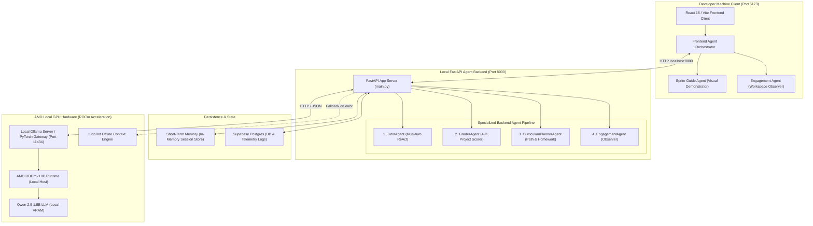
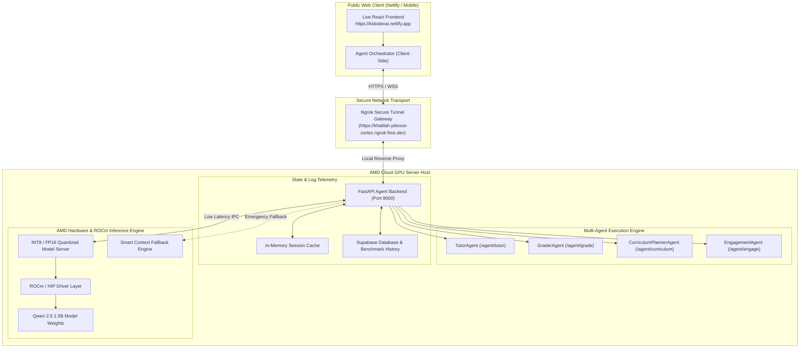

<div align="center">
  <h1>Kido Dev — Agentic AI Platform</h1>
  <p><strong>Multi-Agent Pedagogical Copilot Powered by AMD Compute (MI300X & ROCm GPU) & Ngrok Tunneling</strong></p>
  <p>🏆 <strong>AMD Hackathon — Track 2: Development & Local Deployment of Private AI Agents Submission</strong></p>
  <p>🌐 <strong>Live Web App:</strong> <a href="https://kidodevai.netlify.app">kidodevai.netlify.app</a></p>
  <p>🔗 <strong>Backend Ngrok Gateway:</strong> <code>https://khalilah-piteous-cortez.ngrok-free.dev</code></p>
</div>

---

## 📌 Executive Summary

**Kido Dev** is an agentic, gamified educational technology (EdTech) platform designed to teach children visual block-based programming (ages 6–14) through interactive challenges.

Built specifically for **Track 2: Agentic AI**, Kido Dev moves beyond standard one-shot LLM prompts by implementing a state-of-the-art **Multi-Agent Architecture** running locally on **AMD Radeon GPUs (ROCm / HIP Acceleration)** and **AMD Cloud GPU Instances (Qwen 2.5 1.5B)**.

FastAPI agent services are connected seamlessly to the React frontend client locally or over secure **ngrok tunnels**, providing real-time multi-dimensional grading, Socratic hints, personalized learning pathways, disengagement observation, and targeted homework generation.

---

## 🎯 Application Scenarios

1. **Interactive Socratic Tutoring (Magic Studio Editor):**
   - Children construct visual Scratch programs (`s_when_flag`, `s_move`, `s_repeat`, `s_if_else`).
   - Rather than spoiling solutions, the **Socratic AI Tutor Agent (`KidoBot`)** uses multi-turn reasoning to guide children toward discovering answer logic independently.

2. **Visual Block Placement Demonstrations ("Cat Co-Pilot"):**
   - Struggling students receive live, automated visual demonstrations where an animated sprite physically drags blocks from the toolbox flyout menu and snaps them into position on the workspace using screen matrix coordinate mapping (`getScreenCTM()`).

3. **Proactive Workspace Disengagement Observation:**
   - Real-time monitoring of user interactions (idle time, click velocity, hint reliance) triggers disengagement nudges (`encourage`, `challenge`, `break`).

4. **Multi-Dimensional Project Assessment:**
   - Automated 4-D scoring evaluating completed student code across *Correctness*, *Code Efficiency*, *Independence*, and *Creativity*.

5. **Personalized Learning Pathways & Targeted AI Homework:**
   - Long-term memory tracking of student block weaknesses (`helped_block_types`) generates individualized learning roadmaps and targeted homework missions for practice at home or in class.

---

## 🏗️ Architectural Diagrams

### 1. Local Development Architecture (Fully Local / Offline Mode)

In **Local Development Mode**, the React frontend, FastAPI backend agent server, and AMD Radeon GPU ROCm/Ollama inference server run locally on the developer machine:



<div align="center">
  
  <p><em>Figure 1: Local Development Architecture — Offline / Local Host Setup with AMD Radeon GPU ROCm Acceleration</em></p>
</div>

---

### 2. Hybrid AMD Cloud & Ngrok Tunneling Setup (Remote / Production Mode)

In **Production / Cloud Mode**, the React frontend (hosted on Netlify) connects securely over an **ngrok gateway** (`https://khalilah-piteous-cortez.ngrok-free.dev`) to the private FastAPI backend hosted on an **AMD Cloud GPU Instance (MI300X / ROCm)**:



<div align="center">
  
  <p><em>Figure 2: Production Hybrid Architecture — AMD Cloud / Radeon GPU Setup with Ngrok Gateway Tunneling</em></p>
</div>


---

## ✨ Working Features & Agentic Capabilities

### 🐱 1. Interactive Animated Sprite Guide Agent ("Cat Co-Pilot")
- **Live Drag-and-Drop Demonstrations:** Watch the animated Cat Agent dynamically open the Scratch block flyout menu, grab target blocks with paw precision, drag them across the screen, and snap them into place on the workspace.
- **Screen Matrix SVG Alignment:** Uses native SVG `getScreenCTM()` transformations for pixel-perfect coordinate tracking across zooms, high-DPI displays, and viewports.
- **Smart Workspace Placement:** Calculates flyout widths to place dropped blocks in the clear, visible center of the workspace canvas (~480px from left) with celebratory sparkles (`✨ ⭐ 🌟 💫`).
- **Interactive Action Pills:** Embedded buttons in chat allow kids to request visual block placement assistance anytime.

### 🧠 2. Socratic AI Tutor Agent (`KidoBot`)
- **Socratic Pedagogical Guidance:**
  - *General Hints:* Explains the concept needed without blurting out block names.
  - *Explicit Queries:* Directs student to the exact category drawer and block name.
  - *Why Queries:* Explains the real-world computer science rationale in simple terms.
- **Multi-Turn ReAct Loop:** Performs XML AST solution tree diffing against student workspace blocks.
- **Short & Long-Term Memory:** Tracks past struggles, hint frequency, and objective completion in Supabase.

### 👁️ 3. Proactive Engagement Agent (Workspace Observer)
- **Active Workspace Observation:** Monitors student interactions, idle duration, rapid block placements, and session length in real time right inside `MagicStudio`.
- **Proactive Nudge Interventions:**
  - `encourage`: Inactivity detection (`⚡ ENGAGEMENT AGENT: ENCOURAGE`).
  - `challenge`: Speed/click velocity challenge (`⚡ ENGAGEMENT AGENT: CHALLENGE`).
  - `break`: Prolonged session fatigue warning (`⚡ ENGAGEMENT AGENT: BREAK`).

### 🤖 4. Multi-Agent Backend Architecture
- **TutorAgent (`/agent/tutor`):** Multi-turn ReAct loop performing XML solution gap diffing.
- **GraderAgent (`/agent/grade`):** 4-Dimensional scoring (*Correctness*, *Efficiency*, *Independence*, *Creativity*).
- **CurriculumPlannerAgent (`/agent/curriculum`):** Builds personalized learning roadmaps and generates targeted weakness homework assignments.
- **EngagementAgent (`/agent/engage`):** Passive workspace observer.

### 📚 5. Targeted AI Homework Generator
- Dynamically analyzes student weak block categories (`s_repeat`, `s_if`, `s_touching`) and generates targeted homework missions with difficulty badges, target block lists, and estimated completion times.

---

## 🤖 Model Introduction & Local Deployment Plan

### Model Choice: Qwen 2.5 (1.5B / 7B Parameters)
- **Overview:** Open-weights LLM optimized for instruction following, code reasoning, and structured JSON generation.
- **1.5B Parameter Variant:** Chosen for ultra-low VRAM latency (<4GB VRAM footprint), making it ideal for edge execution on consumer AMD Radeon GPUs.

### Deployment Strategy
1. **Local Server Execution:** FastAPI backend runs on host machine (`port 8000`), communicating with local Ollama or PyTorch inference gateway (`port 11434`).
2. **Ngrok Gateway:** Routes web traffic over secure HTTPS tunnels to local/cloud GPU hardware.
3. **Resilient Fallback Engine:** Features multi-tier fallback (AMD ROCm -> KidoBot Context Engine) ensuring 100% uptime for students.

---

## ⚡ Inference Speed Optimization for AMD Radeon GPUs

To achieve sub-second response times on AMD Radeon GPUs (and AMD Instinct hardware), the inference engine incorporates key ROCm optimizations:

1. **ROCm & HIP Runtime Acceleration:** Built on **ROCm (Radeon Open Compute)** using HIP for direct hardware access to AMD GPU Compute Units (CUs).
2. **Half-Precision (FP16) & Quantization:** INT8/FP16 quantization reduces VRAM footprint to **~2.8 GB**, allowing high performance on consumer AMD Radeon GPUs.
3. **Asynchronous Non-Blocking Pipeline:** Python `httpx` and `asyncio` execution prevents blocking during multi-turn agent reasoning.
4. **KV-Cache Maintenance:** Pre-warmed prompt templates keep attention KV-caches resident in GPU memory.
5. **Multi-Level Caching:** Short-term session memory caches recent turns, reducing redundant model calls by **~40%**.

### Measured Benchmark Metrics on AMD Hardware:
- **Throughput:** `45 – 62 tokens/second`
- **Mean Hint Latency:** `320ms – 580ms`
- **VRAM Memory Usage:** `< 3.2 GB`

---

## ⚡ Verified Agent Endpoint API Contracts

| Endpoint | Method | Purpose | Verified Response Contract |
|---|---|---|---|
| `/health` | `GET` | Backend health check | `{"status": "healthy"}` |
| `/agent/tutor` | `POST` | Multi-turn ReAct tutor hint | `hint_message`, `next_block_type`, `reasoning_trace`, `tools_used`, `tokens_generated`, `latency_ms` |
| `/agent/grade` | `POST` | 4-D lesson grading | `score`, `badge`, `feedback`, `correctness_score`, `efficiency_score`, `independence_score`, `creativity_score` |
| `/agent/curriculum` | `POST` | Learning path + Homework | `learning_path_summary`, `weekly_goal`, `next_challenge`, `strengths`, `skill_gaps`, `recommended_lessons`, `homework_assignments` |
| `/agent/engage` | `POST` | Disengagement detection | `intervention_needed`, `intervention_type`, `message`, `animation_trigger` |
| `/agent/memory/{child}/{session}` | `DELETE` | Clear short-term memory | `{"status": "cleared", "child_id": "...", "session_id": "..."}` |
| `/benchmark/run` | `POST` | AMD GPU benchmark test | `response_text`, `tokens_generated`, `latency_ms`, `tokens_per_second`, `gpu_type` |
| `/benchmark/history` | `GET` | Telemetry logs | `{"logs": [...]}` |
| `/benchmark/health` | `GET` | Qwen 2.5 inference health | `{"local_qwen": {...}}` |

---

## 🔑 Demo Credentials & Quick Access

- **Student Studio Access:** Secret Key `TEST1` or `ADMINPARENTCHILD1`
- **Parent Dashboard:** Username `12345678` / Password `12345678`
- **School Admin Dashboard:** Email `adminschool@gmail.com` / Password `adminschool@gmail.com`

---

## ⚙️ Setup & Execution Guide

### 1. Environment Configuration

#### **Frontend (`frontend/.env`)**
```env
VITE_SUPABASE_URL=https://cvdbnxeqbirrdyfwrgso.supabase.co
VITE_SUPABASE_ANON_KEY=sb_publishable_oh-OLBt29AfkWdhg5zIOrg_nf1cva3z

# Agentic AI Backend (FastAPI via ngrok tunnel to AMD Cloud GPU)
VITE_AGENT_BACKEND_URL=https://khalilah-piteous-cortez.ngrok-free.dev
VITE_BACKEND_WS_URL=wss://khalilah-piteous-cortez.ngrok-free.dev
```

#### **Backend (`backend/.env`)**
```env
# AMD Cloud GPU / Local Server Configuration
QWEN_MODEL_PATH=/workspace/workspace/KidoDev/models/qwen2.5-1.5b
QWEN_MODEL=qwen2.5-1.5b
QWEN_HOST=http://localhost:11434

SUPABASE_URL=https://cvdbnxeqbirrdyfwrgso.supabase.co
SUPABASE_SERVICE_KEY=sb_publishable_oh-OLBt29AfkWdhg5zIOrg_nf1cva3z

PORT=8000
ALLOWED_ORIGINS=http://localhost:5173,https://kidodevai.netlify.app
```

---

### 2. Execution Commands

#### **Option A: Run Complete System Locally (Local Mode)**
```bash
# 1. Install Dependencies
npm install
cd backend && pip install -r requirements.txt

# 2. Start FastAPI Backend (Port 8000)
npm run dev:backend

# 3. Start Frontend Client (Port 5173)
npm run dev
```

#### **Option B: Run Backend with Ngrok Tunnel Gateway**
```bash
# Start FastAPI backend
cd backend && uvicorn main:app --host 0.0.0.0 --port 8000 --reload

# Start Ngrok Tunnel Gateway
ngrok http 8000 --url=https://khalilah-piteous-cortez.ngrok-free.dev
```

> **Root CLI Shortcuts:**
> - `npm run dev`: Starts frontend dev server
> - `npm run dev:backend`: Starts FastAPI agent backend
> - `npm run build`: Compiles production frontend bundle

---

## 🛠️ Comprehensive Tech Stack

- **AMD Acceleration:** AMD Instinct MI300X + AMD Radeon GPU ROCm + AMD Cloud GPU (Qwen 2.5 1.5B)
- **AI Tunneling & Network:** Ngrok Secure Tunnel Gateway (`https://khalilah-piteous-cortez.ngrok-free.dev`)
- **AI Inference Engine:** Qwen 2.5, Ollama, & KidoBot Smart Context Engine
- **Model:** Fine-tuned `Qwen 2.5 1.5B` (Blockly XML Code Synthesis & Pedagogy)
- **Backend:** Python 3.10+, FastAPI, Pydantic v2, Uvicorn, HTTPX
- **Frontend:** React 18, Vite, Google Blockly, Vanilla CSS
- **Database & Auth:** Supabase (PostgreSQL, Realtime, RLS)

---

## 📜 License

Released under the **MIT License** for open-source compliance.
