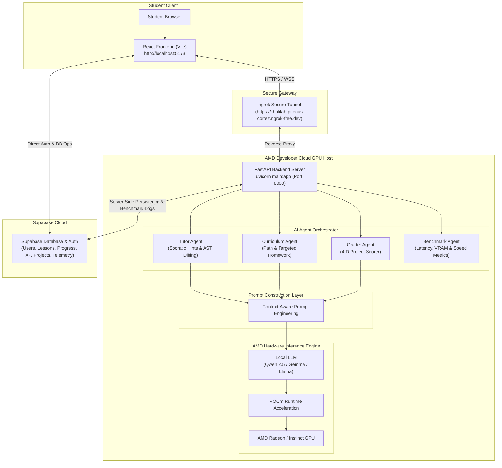

<div align="center">
  <h1>KidoDev + AMD Developer Cloud Architecture</h1>
  <p><strong>Direct AMD GPU Inference & Multi-Agent Pedagogical Copilot</strong></p>
  <p>🏆 <strong>AMD Hackathon — Track 2: Agentic AI Submission</strong></p>
  <p>🌐 <strong>Live Web Application:</strong> <a href="https://kidodevai.netlify.app">kidodevai.netlify.app</a></p>
  <p>🔗 <strong>Backend Ngrok Gateway:</strong> <code>https://khalilah-piteous-cortez.ngrok-free.dev</code></p>
</div>

---

## 📌 Executive Overview

**KidoDev** is an AI-powered educational platform that teaches children Scratch programming through an intelligent AI tutor. The entire AI reasoning pipeline runs directly on an AMD GPU hosted in the **AMD Developer Cloud**, eliminating dependency on external inference providers.

The AMD GPU is responsible for serving the FastAPI backend, executing the AI models using **ROCm**, benchmarking inference performance, and generating personalized tutoring responses in real time.

---

## 🏗️ High-Level Deployment Architecture

```text
                         Student
                            │
                            ▼
                 React Frontend (Vite)
                            │
                    HTTPS / WebSocket
                            │
                            ▼
                    ngrok Secure Tunnel
                            │
                            ▼
                AMD Developer Cloud GPU
      ┌──────────────────────────────────────────┐
      │              FastAPI Backend             │
      │                                          │
      │      AI Agent Orchestrator               │
      │              │                           │
      │              ▼                           │
      │  Tutor │ Curriculum │ Grader Agents      │
      │              │                           │
      │              ▼                           │
      │       Prompt Construction                │
      │              ▼                           │
      │   Local LLM (Qwen / Gemma / Llama)       │
      │              ▼                           │
      │          ROCm Runtime                    │
      │              ▼                           │
      │            AMD GPU                       │
      └──────────────────────────────────────────┘
                      │
                      ▼
                Supabase Database
         (Auth, Progress, Lessons, Projects)
```

### Complete System Mermaid Architecture Diagram



<div align="center">
  
  <p><em>Figure 1: KidoDev + AMD Developer Cloud Architecture — Direct Local AMD GPU Inference via ROCm Stack</em></p>
</div>

---

## 🧩 System Components

### 1. React Frontend
- **Environment:** Runs on the developer's machine (`npm run dev`) at `http://localhost:5173`.
- **Responsibilities:** Student login, Scratch editor (`MagicStudio`), lesson interface, AI Hint Panel, parent dashboard, admin dashboard, progress visualization, and real-time communication with the backend.
- **Inference Note:** The frontend performs no AI inference. It only collects the student's context and sends it to the backend.

### 2. ngrok Secure Tunnel
- **Purpose:** Because the backend runs inside the AMD cloud environment, ngrok exposes it through a secure HTTPS endpoint (`https://khalilah-piteous-cortez.ngrok-free.dev`).
- **Communication Path:** `Browser` → `HTTPS` → `ngrok` → `AMD FastAPI Backend`.

### 3. AMD Developer Cloud
- **Host Infrastructure:** AMD GPU, multi-core CPU, Linux OS environment, Python runtime, ROCm software stack, GPU drivers, and development workspace.
- **Execution Command:** `uvicorn main:app --host 0.0.0.0 --port 8000`

### 4. FastAPI Backend
- **Intelligence Layer Responsibilities:** Receiving frontend requests, managing AI agents, building context prompts, calling local LLMs, processing responses, returning structured JSON, and benchmarking GPU performance.

### 5. AI Agent Architecture
- **Tutor Agent:** Explains Scratch programming concepts, provides hints, answers questions, and guides debugging.
- **Curriculum Agent:** Selects appropriate lessons, adjusts learning difficulty, tracks progression, and generates personalized learning paths with targeted homework missions.
- **Grader Agent:** Evaluates completed Scratch projects, measures correctness, assigns scores, and provides constructive feedback.
- **Benchmark Agent:** Measures system performance on AMD hardware, tracking GPU utilization, inference latency, token generation speed, memory usage, and throughput.

### 6. Local AI Model
- **Execution Engine:** Language models (Qwen 2.5, Gemma, Llama) execute directly on the AMD GPU.
- **Inference Stack:** `Transformers` → `ROCm` → `AMD GPU`.
- **Key Advantages:** No external API dependency, lower latency, offline capability, better privacy, real-time GPU benchmarking, and native AMD hardware acceleration.

### 7. Supabase
- **Data Persistence:** Authentication, student profiles, parent profiles, lessons, progress, XP, achievements, Scratch projects, and learning analytics. Supabase stores and retrieves application data without performing inference.

---

## 🔄 AI Request & Learning Pipeline

When a student requests help:

```text
Student Clicks "Need Hint"
      │
      ▼
React Frontend (Collects Scratch code, lesson metadata, student progress)
      │
      ▼
Send Request to FastAPI (via ngrok tunnel)
      │
      ▼
Agent Orchestrator → Tutor Agent
      │
      ▼
Prompt Builder
      │
      ▼
Local LLM (Qwen / Gemma / Llama)
      │
      ▼
ROCm Runtime → AMD GPU
      │
      ▼
Generate Response → FastAPI Backend
      │
      ▼
JSON Response → React Frontend
      │
      ▼
Display Hint to Student → Progress Saved to Supabase
```

---

## 📊 Benchmark Pipeline

For AMD demonstrations, every AI request can generate live performance metrics:

```text
Prompt
  │
  ▼
AMD GPU Execution
  │
  ▼
Collect Metrics (Latency, GPU Memory, GPU Utilization, Inference Time, Token Speed)
  │
  ▼
Return Metrics → Admin Benchmark Dashboard (/admin)
```

---

## 🔑 Demo Credentials & Quick Access

- **Student Studio Access:** Secret Key `TEST1` or `ADMINPARENTCHILD1`
- **Parent Dashboard:** Username `12345678` / Password `12345678`
- **School Admin Dashboard:** Email `adminschool@gmail.com` / Password `adminschool@gmail.com`

---

## ⚙️ Environment Variables

### **Frontend (`frontend/.env`)**
```env
VITE_SUPABASE_URL=https://cvdbnxeqbirrdyfwrgso.supabase.co
VITE_SUPABASE_ANON_KEY=sb_publishable_oh-OLBt29AfkWdhg5zIOrg_nf1cva3z
VITE_AGENT_BACKEND_URL=https://khalilah-piteous-cortez.ngrok-free.dev
VITE_BACKEND_WS_URL=wss://khalilah-piteous-cortez.ngrok-free.dev
```

### **Backend (`backend/.env`)**
```env
SUPABASE_URL=https://cvdbnxeqbirrdyfwrgso.supabase.co
SUPABASE_SERVICE_ROLE_KEY=sb_publishable_oh-OLBt29AfkWdhg5zIOrg_nf1cva3z
MODEL_NAME=qwen2.5-1.5b
DEVICE=rocm
PORT=8000
ALLOWED_ORIGINS=http://localhost:5173,https://kidodevai.netlify.app
```

---

## 🚀 Why AMD Developer Cloud?

AMD Developer Cloud enables KidoDev to function as a complete AI learning platform without relying on external inference services.

It provides:
1. **High-performance AMD GPUs** for local LLM inference.
2. **ROCm acceleration** for efficient execution of open-source models.
3. A Linux-based development and deployment environment.
4. A platform for measuring latency, throughput, and GPU utilization.
5. A scalable environment that closely resembles production infrastructure.

---

## 📜 License

Released under the **MIT License** for open-source compliance.
