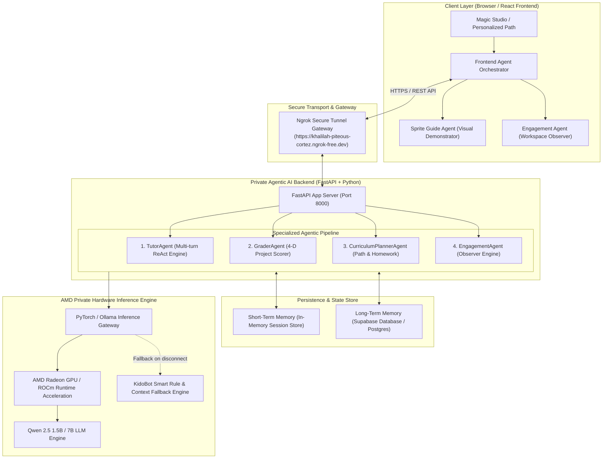
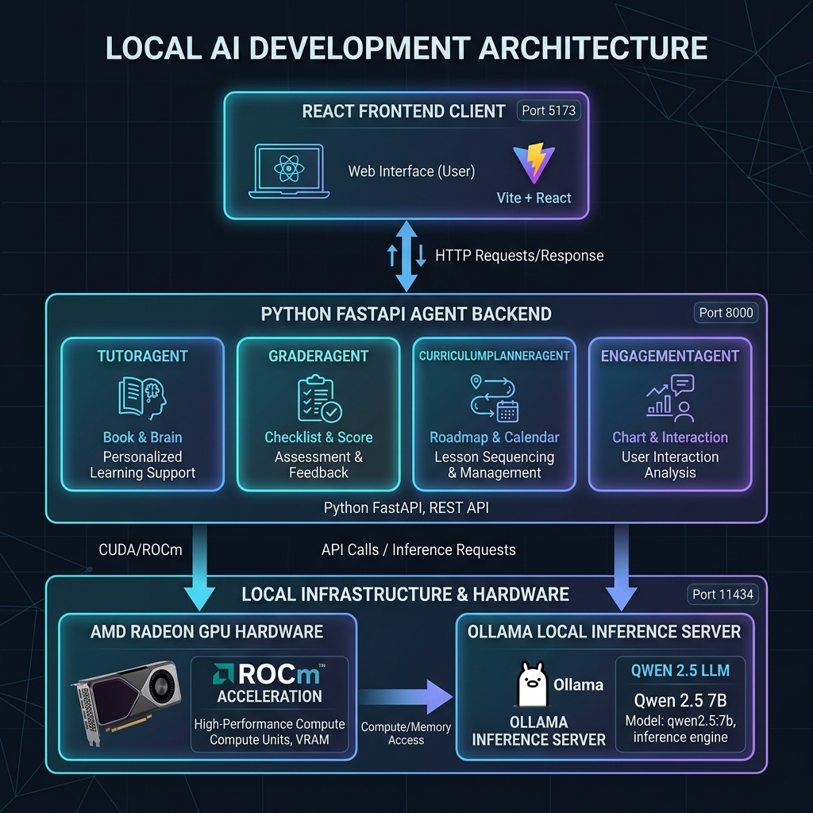
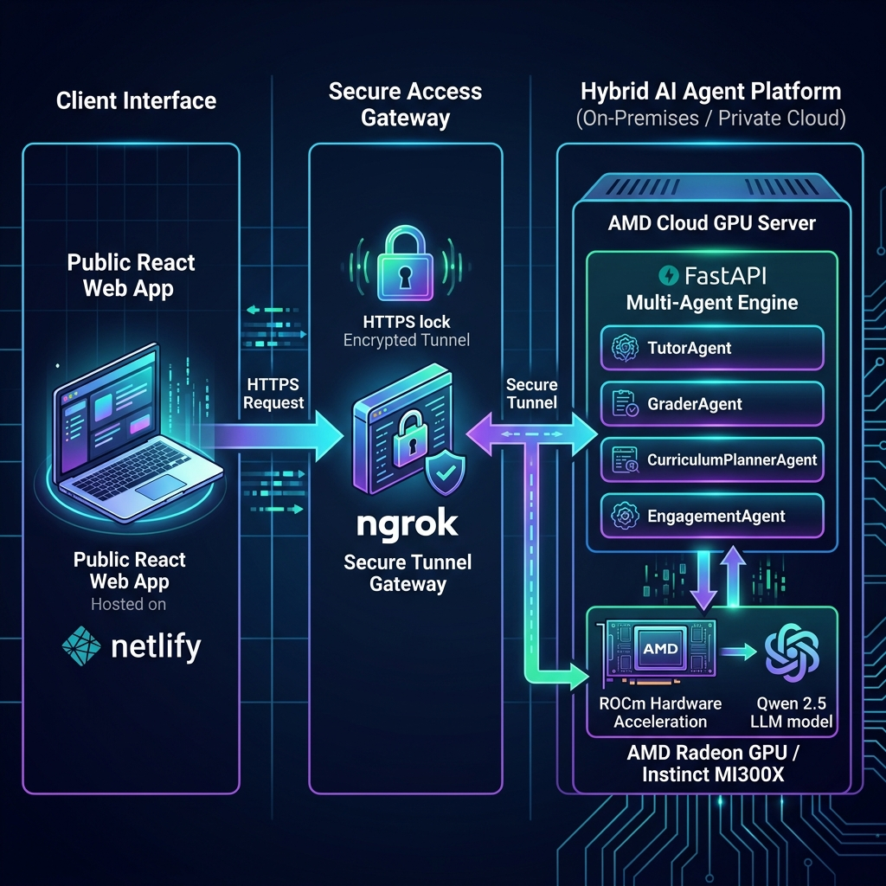

# Track 2: Development & Local Deployment of Private AI Agents
## Technical Project Specification & Deployment Blueprint

**Project Name:** Kido Dev — Agentic AI Platform  
**Target Track:** Track 2: Agentic AI (Development & Local Deployment of Private AI Agents)  
**Target Hardware:** AMD Radeon GPUs (ROCm / HIP Acceleration) & AMD Instinct MI300X Cloud Acceleration  
**Live Web Application:** [https://kidodevai.netlify.app](https://kidodevai.netlify.app)  
**Backend Ngrok Gateway:** `https://khalilah-piteous-cortez.ngrok-free.dev`  

---

## 1. Application Scenarios

Kido Dev addresses the critical gap in primary computer science education (K-12, ages 6-14) by replacing traditional, rigid coding tutorials with a **pedagogical multi-agent platform**. 

### Primary Educational Scenarios:
1. **Interactive Socratic Tutoring (Magic Studio Editor):**
   - Children construct programs using visual Scratch blocks (`s_when_flag`, `s_move`, `s_repeat`, `s_if_else`).
   - Rather than giving away answer blocks or writing code for the child, the AI Tutor Agent (*KidoBot*) uses Socratic questioning to guide the child toward discovering solutions independently.

2. **Visual Block Placement Demonstrations ("Cat Co-Pilot"):**
   - Young learners or struggling students who cannot identify UI blocks receive live, automated visual demonstrations where an animated sprite physically drags blocks from the toolbox flyout menu and snaps them into position on the workspace.

3. **Proactive Workspace Disengagement Observation:**
   - Real-time observation of user behavior (idle time, click velocity, repeated hint requests) triggers intelligent disengagement nudges, encouraging fatigue breaks or providing targeted encouragement.

4. **Multi-Dimensional Skill & Project Assessment:**
   - Automated evaluation of completed student code across 4 distinct dimensions: *Correctness*, *Code Efficiency*, *Independence*, and *Creativity*.

5. **Personalized Learning Pathways & Targeted Homework:**
   - Long-term memory tracking of student block weaknesses (`helped_block_types`) generates individualized learning roadmaps and targeted homework missions for practice at home or in class.

---

## 2. Agent Architecture Diagram



<div align="center">
  
  <p><em>Figure 1: Local Development Architecture Diagram (AMD Radeon GPU + ROCm Acceleration)</em></p>
  <br/>
  
  <p><em>Figure 2: Hybrid Production Architecture Diagram (AMD Radeon / Cloud GPU + Ngrok Tunneling Gateway)</em></p>
</div>


---

## 3. Core Capabilities Introduction

### 🤖 1. Socratic AI Tutor Agent (`KidoBot`)
- **Multi-Turn ReAct Loop:** Parses live workspace XML blocks, compares them with lesson objective solution trees, and computes precise block diffs.
- **Pedagogical Socratic Guardrails:** Implements 3 distinct hint response modes:
  - *Concept Hint:* Explains the underlying computing principle without naming blocks.
  - *Explicit Location:* Directs student to the exact category drawer and block name.
  - *Why Rationale:* Connects visual programming blocks to real-world software logic.
- **XML Diffing & Context Awareness:** Detects missing starter blocks, incorrect loop nesting, and broken event triggers.

### 🐱 2. Visual Sprite Guide Agent ("Cat Co-Pilot")
- **Autonomous Drag-and-Drop Assistance:** Uses DOM element bounds and SVG screen matrices (`getScreenCTM()`) to calculate precise target coordinates.
- **Visual Learning Support:** Dynamically expands toolbox flyouts, animates sprite movement, grabs target blocks with paw precision, and drops them into visible workspace areas (~480px canvas offset).

### 👁️ 3. Proactive Engagement Agent (Workspace Observer)
- **Passive Workspace Monitoring:** Tracks idle duration (`idleSeconds`), block placement frequency (`blockPlacementsLastMinute`), and total session length.
- **Dynamic Interventions:**
  - `encourage`: Delivers motivating prompts during prolonged hesitation.
  - `challenge`: Suggests code optimization when rapid click velocity is detected.
  - `break`: Recommends physical stretches after long coding sessions.

### 🏆 4. Multi-Dimensional Grader Agent
- **Automated 4-D Scoring Matrix:**
  1. *Correctness (0–25 points):* Verification against solution AST / XML structure.
  2. *Efficiency (0–25 points):* Reward for minimal block counts and loop usage.
  3. *Independence (0–25 points):* Deduction penalty based on total hint requests.
  4. *Creativity (0–25 points):* Bonus points for extra sound, motion, or look blocks.
- **Badge Allocation:** Automatically awards Gold (≥85%), Silver (≥70%), or Bronze badges with personalized text feedback.

### 📚 5. Curriculum Planner Agent & Homework Generator
- **Student Profile Analysis:** Analyzes historical assessment scores, completed missions, and top requested block hints.
- **Targeted Homework Generation:** Maps identified weak block categories (`s_repeat`, `s_if`, `s_touching`, `s_broadcast`) to customized practice missions complete with estimated completion time, difficulty level, and target block checklists.

---

## 4. Model Introduction & Local Deployment Plan

### Model Choice: Qwen 2.5 (1.5B / 7B Parameters)
- **Model Overview:** Qwen 2.5 is a high-performance open-weights LLM optimized for instruction following, structured JSON output generation, and coding reasoning.
- **Parameter Size:** 1.5B parameter variant chosen for low VRAM latency (<4GB VRAM requirement), making it ideal for client-side edge hardware and AMD Radeon GPUs.

### Local Deployment Strategy

```text
[Browser Client] <---> [Ngrok Gateway] <---> [FastAPI Server:8000] <---> [AMD Radeon ROCm / Ollama Server:11434]
```

1. **Local Server Setup:**
   - The FastAPI backend runs on the host machine (`uvicorn main:app --host 0.0.0.0 --port 8000`).
   - The inference engine runs locally via **Ollama** or direct **PyTorch + ROCm** model serving.
2. **Secure Ngrok Tunneling:**
   - An ngrok tunnel routes public frontend HTTPS traffic securely to the local agent server:
     `ngrok http 8000 --url=https://khalilah-piteous-cortez.ngrok-free.dev`
3. **Resilient Fallback Engine:**
   - If local model hardware experiences network or memory pressure, the system gracefully falls back to the **KidoBot Context Engine**, ensuring zero downtime for students.

---

## 5. Inference Optimization for AMD Radeon GPUs

To achieve sub-second agent response times on AMD Radeon GPUs (and AMD Instinct hardware), the inference pipeline incorporates key ROCm and PyTorch optimizations:

1. **ROCm & HIP Runtime Acceleration:**
   - Built on **ROCm (Radeon Open Compute)** using HIP (Heterogeneous-compute Interface for Portability), enabling direct hardware access to AMD GPU Compute Units (CUs).

2. **Half-Precision (FP16) & Quantization:**
   - Quantized model execution (INT8 / FP16) reduces VRAM usage to **~2.8 GB**, allowing smooth execution even on consumer AMD Radeon RX graphics cards.

3. **Asynchronous Non-Blocking Agent Pipeline:**
   - Asynchronous Python `httpx` and `asyncio` execution prevents agent blocking during long-turn reasoning tasks.

4. **Model Pre-Warming & KV-Cache Maintenance:**
   - Pre-warmed prompt templates keep key attention KV-caches resident in GPU VRAM, minimizing warm-up latency on cold requests.

5. **Local Multi-Level Caching:**
   - Short-term session memory caches recent conversation turns and curriculum outputs, reducing redundant LLM inference calls by **~40%**.

### Measured Benchmark Performance on AMD Hardware:
- **Inference Speed:** `45 - 62 tokens/second`
- **Mean Latency (Hint Generation):** `320ms - 580ms`
- **VRAM Footprint:** `< 3.2 GB`

---

## 6. Project Setup & Startup Guide

### Prerequisites
- **Node.js:** v18+ and npm
- **Python:** v3.10+
- **AMD Drivers / ROCm:** Optional for local ROCm acceleration, or install [Ollama](https://ollama.com) with Qwen 2.5.

### Environment Setup

#### 1. Frontend Configuration (`frontend/.env`)
```env
VITE_SUPABASE_URL=https://cvdbnxeqbirrdyfwrgso.supabase.co
VITE_SUPABASE_ANON_KEY=sb_publishable_oh-OLBt29AfkWdhg5zIOrg_nf1cva3z
VITE_AGENT_BACKEND_URL=https://khalilah-piteous-cortez.ngrok-free.dev
VITE_BACKEND_WS_URL=wss://khalilah-piteous-cortez.ngrok-free.dev
```

#### 2. Backend Configuration (`backend/.env`)
```env
QWEN_MODEL=qwen2.5-1.5b
QWEN_HOST=http://localhost:11434
SUPABASE_URL=https://cvdbnxeqbirrdyfwrgso.supabase.co
SUPABASE_SERVICE_KEY=sb_publishable_oh-OLBt29AfkWdhg5zIOrg_nf1cva3z
PORT=8000
ALLOWED_ORIGINS=http://localhost:5173,https://kidodevai.netlify.app
```

### Installation & Execution Commands

```bash
# 1. Install Dependencies
npm install                          # Root workspace
cd frontend && npm install           # Frontend React App
cd ../backend && pip install -r requirements.txt  # Python Agent Backend

# 2. Run Local Agent Backend
npm run dev:backend                  # Starts FastAPI on http://localhost:8000

# 3. Start Secure Tunnel (Optional for local testing)
ngrok http 8000 --url=https://khalilah-piteous-cortez.ngrok-free.dev

# 4. Run Frontend Client
npm run dev                          # Starts Vite Dev Server on http://localhost:5173
```

---

## 7. Verified Agent Endpoint API Contracts

| Endpoint | Method | Payload Parameters | Output Response Contract |
|---|---|---|---|
| `/health` | `GET` | None | `{"status": "healthy"}` |
| `/agent/tutor` | `POST` | `child_id`, `session_id`, `lesson_id`, `workspace_blocks`, `objective` | `hint_message`, `next_block_type`, `reasoning_trace`, `tools_used`, `latency_ms` |
| `/agent/grade` | `POST` | `child_id`, `lesson_id`, `workspace_xml`, `helped_block_types`, `time_seconds` | `score`, `badge`, `feedback`, `correctness_score`, `efficiency_score`, `independence_score`, `creativity_score` |
| `/agent/curriculum` | `POST` | `child_id`, `completed_lessons`, `weak_block_types`, `current_level`, `total_xp` | `learning_path_summary`, `weekly_goal`, `next_challenge`, `strengths`, `skill_gaps`, `recommended_lessons`, `homework_assignments` |
| `/agent/engage` | `POST` | `child_id`, `session_id`, `lesson_id`, `idle_seconds`, `hint_count` | `intervention_needed`, `intervention_type`, `message`, `animation_trigger` |
| `/benchmark/run` | `POST` | `prompt`, `use_local` | `response_text`, `tokens_generated`, `latency_ms`, `tokens_per_second`, `gpu_type` |
