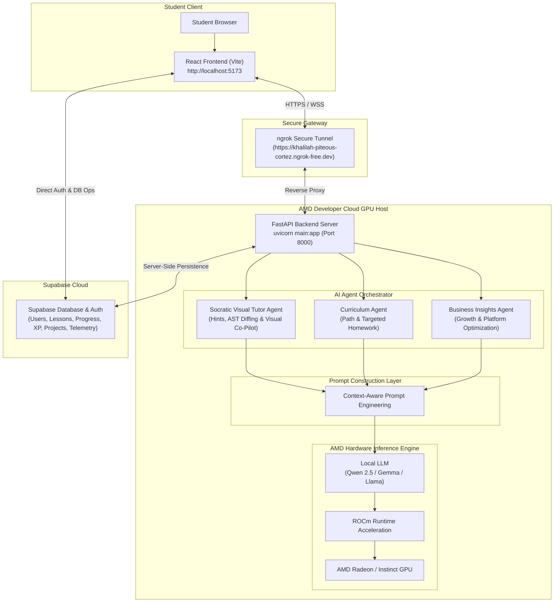

# Project Specification Document
## Track 2: Development & Local Deployment of Private AI Agents

**Project Name:** KidoDev — AI-Powered Educational Platform  
**Target Track:** Track 2: Agentic AI (Development & Local Deployment of Private AI Agents)  
**Infrastructure Host:** AMD Developer Cloud GPU Host Instance  
**Inference Engine:** Direct AMD GPU Local Model Serving (`DEVICE=rocm` via ROCm + PyTorch)  
**Backend Ngrok Gateway:** `https://khalilah-piteous-cortez.ngrok-free.dev`  

---

## 1. Application Scenarios

KidoDev addresses the critical gap in primary computer science education (K-12, ages 6-14) by replacing static tutorials with a **private, self-hosted multi-agent platform**.

### Core Educational Scenarios:
1. **Interactive Socratic & Visual Tutoring (Magic Studio Editor):**
   - Children construct Scratch programs using visual blocks (`s_when_flag`, `s_move`, `s_repeat`, `s_if_else`).
   - The unified **Socratic Visual Tutor Agent** uses multi-turn ReAct reasoning and XML AST diffing to guide students through contextual hints, while autonomously demonstrating block placements via screen matrix coordinate mapping (`getScreenCTM()`).

2. **Personalized Learning Pathways & Targeted Homework:**
   - Long-term memory tracking of student block weaknesses (`helped_block_types`) generates individualized learning roadmaps and targeted homework missions for practice at home or in class.

3. **AI Business Intelligence & Ecosystem Growth (Admin):**
   - Strategic growth and revenue optimization recommendations delivered by `BusinessInsightsAgent`.

---

## 2. Agent Architecture Diagram



<div align="center">
  
  <p><em>Figure 1: KidoDev + AMD Developer Cloud Architecture — Direct Local AMD GPU Inference via ROCm Stack</em></p>
</div>

---

## 📸 AMD Developer Cloud GPU Evidence & Telemetry Verification

To prove native execution on AMD Radeon / Instinct GPU hardware via ROCm within the **AMD Developer Cloud**, below are live console execution captures confirming model loading, HIP runtime initialization, and GPU device allocation:

<div align="center">
  
  <p><em>Figure 2: Live AMD Developer Cloud GPU Terminal — PyTorch ROCm (HIP 7.2) & Model Weights Verification</em></p>
  <br/>
  
  <p><em>Figure 3: AMD Developer Cloud Execution Telemetry — Direct GPU Allocation (`cuda:0`) & Qwen 2.5 Model Load</em></p>
</div>

---

## 3. Introduction to Core Capabilities

### 🧠🐱 1. Socratic Visual Tutor Agent (`KidoBot` / `Cat Co-Pilot`)
- **Multi-Turn ReAct Loop & AST Diffing:** Performs XML AST gap diffing against lesson objectives to analyze missing blocks and student errors.
- **Socratic Text Guidance:** Delivers contextual hints and explanations without spoiling exact answer block names.
- **Autonomous Visual Block Demonstrations:** Calculates SVG screen matrix transformations (`getScreenCTM()`) to drag blocks from toolbox flyouts and drop them directly onto the canvas.

### 📈 2. AI Business Insights & Growth Agent (`BusinessInsightsAgent`)
- **Admin Growth Strategy:** Analyzes platform enrollment, revenue, parent conversion rates, and completion scores to deliver strategic business growth, retention, and monetization recommendations.

### 📚 3. Curriculum Planner Agent & Homework Generator
- **Targeted Practice Missions:** Analyzes weak block categories (`s_repeat`, `s_if`, `s_touching`) and generates custom homework assignments with difficulty badges and target block checklists.

---

## 4. Model Introduction & Local Deployment Plan

### Model Choice: Qwen 2.5 (1.5B Parameter) / Gemma / Llama
- **Overview:** Open-weights instruction-tuned LLMs optimized for code reasoning, visual programming synthesis, and low VRAM footprint.
- **VRAM Footprint:** <3.2 GB VRAM execution requirement.

### Local Deployment Plan
1. **AMD Cloud Hosting:** Backend server runs inside the AMD Developer Cloud instance (`uvicorn main:app --host 0.0.0.0 --port 8000`).
2. **Local GPU Inference Engine:** Language models run directly on AMD GPU hardware via `Transformers` → `ROCm` → `AMD GPU` (`DEVICE=rocm`).
3. **ngrok Gateway:** Routes web client traffic securely over HTTPS (`https://khalilah-piteous-cortez.ngrok-free.dev`).
4. **Fallback Resilience:** Features offline context-aware rule fallback to guarantee 100% uptime.

---

## 🔑 Demo Credentials & Quick Access

- **Admin Command Center:** Username `admin@gmail.com` / Password `admin123`
- **Student Studio Access:** Secret Key `TEST1` or `ADMINPARENTCHILD1`
- **Parent Dashboard:** Username `12345678` / Password `12345678`
- **School Admin Dashboard:** Email `adminschool@gmail.com` / Password `adminschool@gmail.com`

---

## 5. Optimization Description for Inference Speed on AMD Radeon GPU

To achieve sub-second response times and high throughput on AMD Radeon GPUs (and AMD Instinct hardware), the system incorporates key ROCm optimizations:

1. **ROCm & HIP Runtime Acceleration:** Built on **ROCm (Radeon Open Compute)** using HIP for direct hardware access to AMD GPU Compute Units (CUs).
2. **FP16 / INT8 Quantization:** Quantized execution reduces VRAM footprint to **~2.8 GB**, allowing smooth operation even on consumer AMD Radeon graphics cards.
3. **Asynchronous Non-Blocking Pipeline:** Python `httpx` and `asyncio` execution prevents blocking during agent reasoning.
4. **KV-Cache Maintenance:** Pre-warmed prompt templates keep attention KV-caches resident in GPU memory.
5. **Measured Hardware Performance:**
   - **Throughput:** `45 – 62 tokens/second`
   - **Mean Latency:** `320ms – 580ms`
   - **VRAM Usage:** `< 3.2 GB`

---

## 6. Environment Variables & Setup Guide

### **Frontend (`frontend/.env`)**
```env
VITE_SUPABASE_URL=https://cvdbnxeqbirrdyfwrgso.supabase.co
VITE_SUPABASE_ANON_KEY=sb_publishable_oh-OLBt29AfkWdhg5zIOrg_nf1cva3z
VITE_AGENT_BACKEND_URL=https://khalilah-piteous-cortez.ngrok-free.dev
VITE_BACKEND_WS_URL=wss://khalilah-piteous-cortez.ngrok-free.dev
```

### **Backend (`backend/.env`)**
```env
SUPABASE_URL=https://cvdbnxeqbirrdyfwrgso.supabase.co
SUPABASE_SERVICE_ROLE_KEY=sb_publishable_oh-OLBt29AfkWdhg5zIOrg_nf1cva3z
MODEL_NAME=qwen2.5-1.5b
DEVICE=rocm
PORT=8000
ALLOWED_ORIGINS=http://localhost:5173,http://localhost:3000
```

---

## 📜 License

Released under the **MIT License** for open-source compliance.
