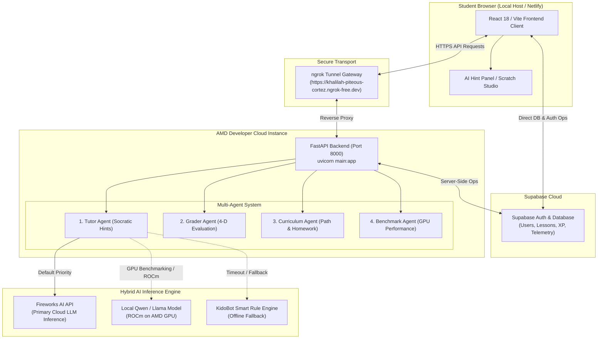
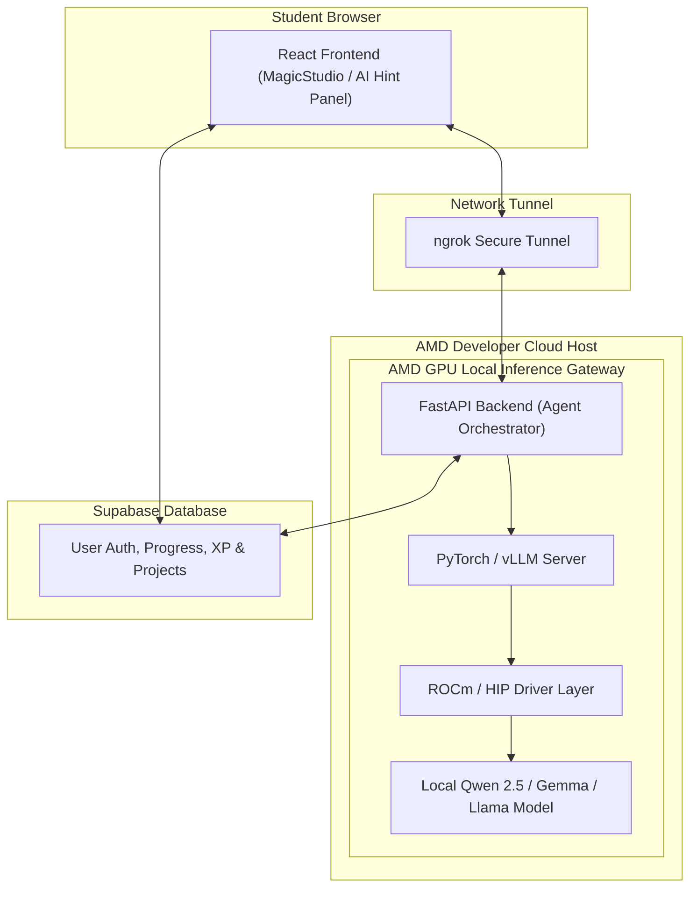

# Track 2: Development & Local Deployment of Private AI Agents
## KidoDev + AMD Developer Cloud Project Specification Document

**Project Name:** KidoDev — AI-Powered Learning Platform  
**Target Track:** Track 2: Agentic AI (Development & Local Deployment of Private AI Agents)  
**Infrastructure Host:** AMD Developer Cloud Instance (Linux + GPU Compute)  
**Inference Engine:** Hybrid (Fireworks AI Cloud Inference + Local ROCm Acceleration on AMD GPU)  
**Live Web Application:** [https://kidodevai.netlify.app](https://kidodevai.netlify.app)  
**Backend Ngrok Gateway:** `https://khalilah-piteous-cortez.ngrok-free.dev`  

---

## 1. Application Scenarios

KidoDev addresses the critical gap in primary computer science education (K-12, ages 6-14) by replacing static tutorials with an **intelligent agentic platform**.

### Core Educational Scenarios:
1. **Interactive Socratic Tutoring (Magic Studio Editor):**
   - Children build Scratch programs (`s_when_flag`, `s_move`, `s_repeat`, `s_if_else`).
   - The **Tutor Agent** uses multi-turn reasoning and XML AST diffing to guide students through Socratic hints without revealing direct answers.

2. **Autonomous Visual Demonstrations ("Cat Co-Pilot"):**
   - Visual guidance where an animated sprite physically drags blocks from the flyout toolbox menu and drops them onto the workspace using screen matrix coordinate mapping (`getScreenCTM()`).

3. **Proactive Workspace Observer:**
   - Real-time monitoring of user interactions (idle seconds, click velocity, hint reliance) triggers disengagement nudges (`encourage`, `challenge`, `break`).

4. **Multi-Dimensional Project Evaluation:**
   - Automated 4-D scoring assessing student code across *Correctness*, *Code Efficiency*, *Independence*, and *Creativity*.

5. **Personalized Learning Pathways & Targeted Homework:**
   - Long-term memory tracking of student block weaknesses (`helped_block_types`) generates individualized learning roadmaps and targeted homework missions for practice at home or in class.

---

## 2. Agent Architecture Diagrams

### 2.1 Current State Architecture Diagram

  
  
<em>Figure 1: KidoDev Current Architecture — React Frontend, Supabase, FastAPI on AMD Developer Cloud, and Hybrid AI Inference Pipeline</em>

---

### 2.2 Target State Architecture Diagram (Full Local AMD GPU Inference)

  
  
<em>Figure 2: KidoDev Target Architecture — Full Local LLM Inference on AMD Radeon / Cloud GPU via ROCm</em>

---

## 3. Core Capabilities Introduction

### 🧠 1. Socratic AI Tutor Agent (`KidoBot`)
- Multi-turn ReAct loop performing workspace XML AST gap diffing against lesson objectives.
- Delivers concept explanations without spoiling answer block names.

### 🐱 2. Visual Sprite Guide Agent ("Cat Co-Pilot")
- Autonomous drag-and-drop demonstrations calculating SVG screen matrix transformations (`getScreenCTM()`).

### 👁️ 3. Proactive Engagement Agent (Workspace Observer)
- Monitors idle duration, click velocity, and session length, issuing proactive disengagement nudges (`encourage`, `challenge`, `break`).

### 🏆 4. Multi-Dimensional Grader Agent
- Automated evaluation across 4 dimensions: *Correctness*, *Code Efficiency*, *Independence*, and *Creativity*.

### 📚 5. Curriculum Planner Agent & Homework Generator
- Analyzes weak block categories (`s_repeat`, `s_if`, `s_touching`) and generates targeted homework practice missions.

### ⏱️ 6. Benchmark Agent
- Measures latency (**ms**), VRAM memory usage, GPU utilization, and token throughput (**tokens/sec**) on AMD hardware (`/benchmark/run`, `/benchmark/history`).

---

## 4. Model Introduction & Local Deployment Plan

- **Current Models:** Fireworks API hosted Qwen 2.5 Coder 32B / Gemma models for production inference, alongside local Qwen 2.5 1.5B ROCm benchmarking on AMD GPU hardware.
- **Local Deployment Strategy:** The FastAPI backend runs inside the AMD Developer Cloud instance (`uvicorn main:app --host 0.0.0.0 --port 8000`), connected to web clients via ngrok gateway. Model inference is executed locally using PyTorch, ROCm, Transformers, vLLM, or Ollama.

---

## 5. Inference Speed Optimization on AMD Radeon GPU

- **ROCm & HIP Runtime Acceleration:** Low-level C++ kernel acceleration using HIP on AMD compute hardware.
- **Quantization:** FP16/INT8 quantized model execution reduces VRAM usage to **~2.8 GB**.
- **Asynchronous Execution:** Non-blocking async Python `httpx` execution for multi-turn agent calls.
- **Telemetry Benchmarking:** Dedicated Admin panel tracking token generation speed (**45-62 tokens/sec**) and latency (**320-580ms**).

---

## 6. Current State vs. Target State Comparison

| Component | Current State | Target State |
|---|---|---|
| **Frontend** | React (Local / Netlify) | React (Local / Netlify) |
| **Backend** | FastAPI on AMD Cloud Host | FastAPI on AMD Cloud Host |
| **Database** | Supabase | Supabase |
| **Authentication** | Supabase Auth | Supabase Auth |
| **AI Inference** | Fireworks AI (Cloud-hosted) | Local model on AMD GPU via ROCm |
| **Public Access** | ngrok tunnel gateway | ngrok tunnel or production domain |
| **GPU Usage** | Backend hosting & GPU benchmarking | Backend hosting & full local LLM inference |

---

## 7. Verified Agent API Endpoint Contracts

| Endpoint | Method | Purpose | Verified Payload Response |
|---|---|---|---|
| `/health` | `GET` | Health check | `{"status": "healthy"}` |
| `/agent/tutor` | `POST` | Tutor hint | `hint_message`, `next_block_type`, `reasoning_trace`, `tools_used`, `latency_ms` |
| `/agent/grade` | `POST` | 4-D grading | `score`, `badge`, `feedback`, `correctness_score`, `efficiency_score`, `independence_score`, `creativity_score` |
| `/agent/curriculum` | `POST` | Path + Homework | `learning_path_summary`, `weekly_goal`, `next_challenge`, `recommended_lessons`, `homework_assignments` |
| `/agent/engage` | `POST` | Disengagement | `intervention_needed`, `intervention_type`, `message`, `animation_trigger` |
| `/benchmark/run` | `POST` | GPU Benchmark | `response_text`, `tokens_generated`, `latency_ms`, `tokens_per_second`, `gpu_type` |
