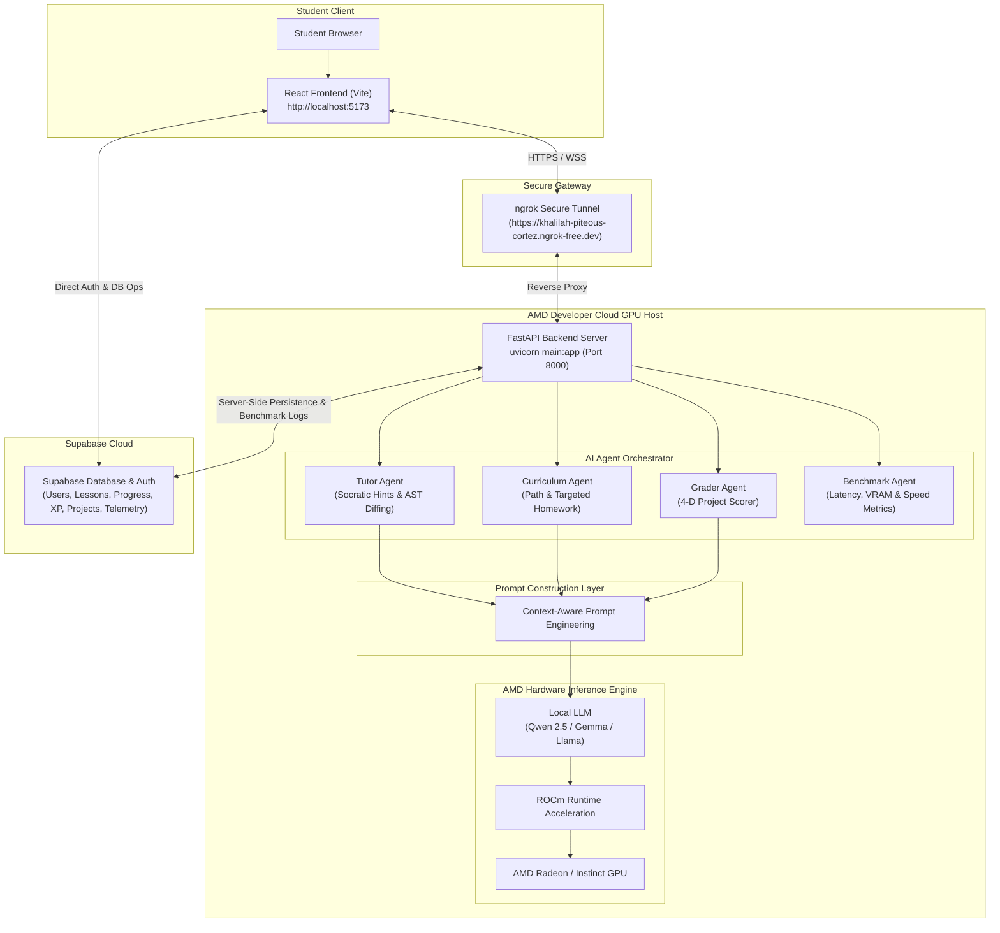

# Track 2: Development & Local Deployment of Private AI Agents
## KidoDev + AMD Developer Cloud Project Specification Document

**Project Name:** KidoDev — AI-Powered Learning Platform  
**Target Track:** Track 2: Agentic AI (Development & Local Deployment of Private AI Agents)  
**Infrastructure Host:** AMD Developer Cloud GPU Host Instance  
**Inference Engine:** Direct AMD GPU Local Inference (`DEVICE=rocm` via ROCm + PyTorch)  
**Live Web Application:** [https://kidodevai.netlify.app](https://kidodevai.netlify.app)  
**Backend Ngrok Gateway:** `https://khalilah-piteous-cortez.ngrok-free.dev`  

---

## 1. Executive Overview & Application Scenarios

**KidoDev** is an AI-powered educational platform that teaches children Scratch programming through an intelligent AI tutor. The entire AI reasoning pipeline runs directly on an AMD GPU hosted in the **AMD Developer Cloud**, eliminating dependency on external inference providers.

The AMD GPU is responsible for serving the FastAPI backend, executing the AI models using **ROCm**, benchmarking inference performance, and generating personalized tutoring responses in real time.

### Core Educational Scenarios:
1. **Interactive Socratic Tutoring (Magic Studio Editor):**
   - Children construct Scratch programs (`s_when_flag`, `s_move`, `s_repeat`, `s_if_else`).
   - The **Tutor Agent** uses multi-turn reasoning and XML AST diffing to guide students through Socratic hints without revealing direct answers.

2. **Autonomous Visual Demonstrations ("Cat Co-Pilot"):**
   - Visual guidance where an animated sprite physically drags blocks from the flyout toolbox menu and drops them onto the workspace using screen matrix coordinate mapping (`getScreenCTM()`).

3. **Proactive Workspace Observer:**
   - Real-time monitoring of user interactions (idle seconds, click velocity, hint reliance) triggers disengagement nudges (`encourage`, `challenge`, `break`).

4. **Multi-Dimensional Project Evaluation:**
   - Automated 4-D scoring assessing student code across *Correctness*, *Code Efficiency*, *Independence*, and *Creativity*.

5. **Personalized Learning Pathways & Targeted Homework:**
   - Long-term memory tracking of student block weaknesses (`helped_block_types`) generates individualized learning roadmaps and targeted homework missions for practice at home or in class.

---

## 2. High-Level & Deployment Architecture Diagrams

### High-Level Architectural Flow

```text
                         Student
                            │
                            ▼
                 React Frontend (Vite)
                            │
                    HTTPS / WebSocket
                            │
                            ▼
                    ngrok Secure Tunnel
                            │
                            ▼
                AMD Developer Cloud GPU
      ┌──────────────────────────────────────────┐
      │              FastAPI Backend             │
      │                                          │
      │      AI Agent Orchestrator               │
      │              │                           │
      │              ▼                           │
      │  Tutor │ Curriculum │ Grader Agents      │
      │              │                           │
      │              ▼                           │
      │       Prompt Construction                │
      │              ▼                           │
      │   Local LLM (Qwen / Gemma / Llama)       │
      │              ▼                           │
      │          ROCm Runtime                    │
      │              ▼                           │
      │            AMD GPU                       │
      └──────────────────────────────────────────┘
                      │
                      ▼
                Supabase Database
         (Auth, Progress, Lessons, Projects)
```

### Complete System Mermaid Architecture Diagram



<div align="center">
  
  <p><em>Figure 1: KidoDev + AMD Developer Cloud Architecture — Direct Local AMD GPU Inference via ROCm Stack</em></p>
</div>

---

## 3. System Components & AI Agents

### 1. React Frontend
- Runs on developer machine (`http://localhost:5173`).
- Responsibilities: Student login, Scratch editor (`MagicStudio`), lesson interface, AI Hint Panel, parent/admin dashboards, progress visualization. Performs no AI inference.

### 2. ngrok Secure Tunnel
- Exposes backend running inside the AMD cloud environment via HTTPS (`https://khalilah-piteous-cortez.ngrok-free.dev`).

### 3. AMD Developer Cloud
- Hosts the backend services on an AMD GPU instance with ROCm software stack and GPU drivers (`uvicorn main:app --host 0.0.0.0 --port 8000`).

### 4. FastAPI Backend
- Intelligence layer managing agent orchestration, prompt building, calling local LLMs, returning JSON, and benchmarking GPU metrics.

### 5. Specialized AI Agent System
- **Tutor Agent:** Explains concepts, provides Socratic hints, answers questions, guides debugging.
- **Curriculum Agent:** Selects lessons, adjusts difficulty, generates paths and targeted homework.
- **Grader Agent:** Evaluates project submissions across 4 dimensions (*Correctness*, *Efficiency*, *Independence*, *Creativity*).
- **Benchmark Agent:** Tracks GPU utilization, inference latency, token generation speed, and VRAM memory usage.

### 6. Local AI Model
- Executes directly on the AMD GPU (Qwen 2.5, Gemma, Llama). Stack: `Transformers` → `ROCm` → `AMD GPU`.

### 7. Supabase
- Stores authentication, profiles, lessons, progress, XP, achievements, Scratch project XMLs, and analytics.

---

## 4. AI Request & Benchmark Pipeline

### AI Request Flow
```text
Student Clicks "Need Hint" → React Frontend collects context → Send to FastAPI via ngrok → Agent Orchestrator → Tutor Agent → Prompt Builder → Local LLM → ROCm Runtime → AMD GPU → Generate response → FastAPI → JSON Response → React Frontend → Display Hint → Save Progress to Supabase
```

### Benchmark Pipeline
```text
Prompt → AMD GPU Model Execution → Collect Metrics (Latency, GPU Memory, GPU Utilization, Inference Time, Token Speed) → Return Metrics → Admin Benchmark Dashboard
```

---

## 5. Environment Variables & Deployment Setup

### **Frontend (`frontend/.env`)**
```env
VITE_SUPABASE_URL=https://cvdbnxeqbirrdyfwrgso.supabase.co
VITE_SUPABASE_ANON_KEY=sb_publishable_oh-OLBt29AfkWdhg5zIOrg_nf1cva3z
VITE_AGENT_BACKEND_URL=https://khalilah-piteous-cortez.ngrok-free.dev
VITE_BACKEND_WS_URL=wss://khalilah-piteous-cortez.ngrok-free.dev
```

### **Backend (`backend/.env`)**
```env
SUPABASE_URL=https://cvdbnxeqbirrdyfwrgso.supabase.co
SUPABASE_SERVICE_ROLE_KEY=sb_publishable_oh-OLBt29AfkWdhg5zIOrg_nf1cva3z
MODEL_NAME=qwen2.5-1.5b
DEVICE=rocm
PORT=8000
ALLOWED_ORIGINS=http://localhost:5173,https://kidodevai.netlify.app
```

---

## 6. Why AMD Developer Cloud?

AMD Developer Cloud enables KidoDev to function as a complete AI learning platform without external inference APIs, demonstrating high-performance AMD GPUs, ROCm acceleration, real-world latency benchmarking, and end-to-end local agent execution.
